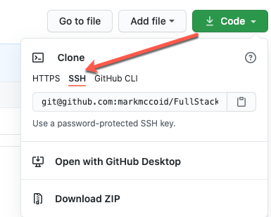
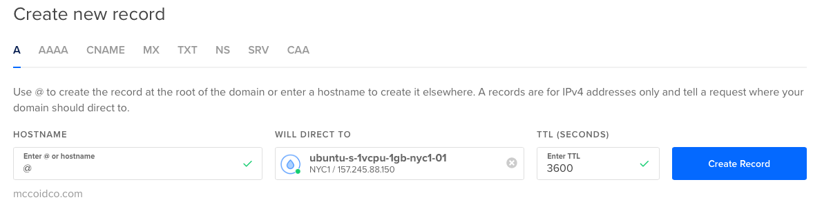

## Resources

[Fail2Ban](https://www.techrepublic.com/article/how-to-install-fail2ban-on-ubuntu-server-18-04/) - For production server, this will ban people who try and fail to login x number of times.

[Express Performance](http://expressjs.com/en/advanced/best-practice-performance.html)


## Setting up SSH keys on a Mac.

Go to the SSH Directory and if it doesn't exist, create it.

```bash
$ cd ~/.ssh
# If this directory doesn't exist, then create it (the -p says to make if it doesn't exist)
$ mkdir -p ~/.ssh
```

Next, you will need to create your keys by running `ssh-keygen`

```bash
$ ssh-keygen
# you will be prompted for a name and an optional passphrase
```

This will create two files in your ssh directory.  For example, if you named your key `mykey` then you would have the following in your directory:

```bash
mykey
mykey.pub
```

The .pub is your public key.  This is the one that goes on your server.

## Setting up SSH Keys on Windows

Pretty much the same as above, but use **powershell**

You keys will be located in your user directory `.ssh` 

You can use Powershell to ssh into your server.

### Setting up Multiple SSH Keys

If you have multiple server and you want each to have it's own SSH key, you can do the following:

1. Create the SSH Key on the target machine (i.e. the client that is going to be logging into the server)

2. Copy the public key to a machine that has access to the server.

3. Append the public key data to the ~/.ssh/authorized_keys files

   ```bash
   $ echo "ssh-rsa AAAAB3NzaC1yc2EAAAADAQABAAABAQDLxXZr2gVHgwdnhi05D9VxDEVjHcFLr4NZ7WaayV9uQgOD9qXxSjyZNr5oMzyr4z1dOZRzf+CnoLZgM4wZ11IJ9hKZoOMchPUjRw5qwLJPbS/z1Kk3vGrRgjI2kA5kPi1l0P5E84RwGA+fil+qUTgj2IaYxc97C8DzTWHCg37oXSVz8gnKMrU633OLUeIp9JuoA+TEPn7KLKYy98I2m62mvnHOoXn7vRIqyMuHtTne/zHNjCkNWWuNURLGw1wpaPGBMeRLgvi0ZLz2bj2TrbFfWqHL+yJpMCD7wXjlYOs5lHFRRkUlDvjh3GHfPzKp7vmJ3+xml2R9a1BNwlEBWstx markm@DESKTOP-HR5U3AQ" >> ~/.ssh/authorized_keys
   ```

Not sure if the permissions stuff is needed.

Once the `authorized_keys` file contains the public key, you need to update permissions on some of the files. The `~/.ssh` directory and `authorized_keys` file must have specific restricted permissions (`700` for `~/.ssh` and `600` for `authorized_keys`). If they don't, you won't be able to log in.

Make sure the permissions and ownership of the files are correct.

```shell
$ chmod -R go= ~/.ssh
$ chown -R $USER:$USER ~/.ssh
```


### Logging into your server via SSH

> When you set up your server, you will be prompted for the SSH key to use

```bash
# substitute your ip address
$ ssh root@100.100.100.100

# This will most likely deny you access since it doesn't know which key to check
$ ssh -i mykey root@100.100.100.100
```

Since you don't want to have to type the `-i mykey` every time, you need to create a config file in your ssh directory with the following.

```bash
# first cd into the ssh directory
$ cd ~/.ssh
$ vi config

# Enter the following into the config file and save
Host *
 AddKeysToAgent yes
 UseKeychain yes
```

To manually add to the keychain use the command below. 

> NOTE: you don't need to do this if your config file has the above lines.

```bash
ssh-add -K ~/.ssh/mykey
```

## Updating your Server

To update the software on your server do the following:

```bash
$ apt update
$ apt upgrade
```

### Add New User

Once you update your software you should create a new user so that you DO NOT login as root.

We will be creating doing the following:

- Create a New User 
- Give that user super user rights
- create an .ssh directory and copy public key over
- disable root access

```bash
# Create a User on your server
$ adduser username

# Give user "sudo" rights (Super User DO)
# you are saying "add username to the super users group"
$ usermod -aG sudo username

# now login as your new user using su (Switch User)
# don't think you will be asked for password,
$ su username

# Check sudo access - This is the auth.log and contains information about happenings on your server
$ sudo cat /var/log/auth.log

# Make sure you are in your root and then make the .ssh directory
$ cd ~
$ mkdir -p ~/.ssh

# Create a new authorized_keys file and copy your public key into it.
# See above for where that key is located on your current machine (NOT Server, but the machine you are
# accessing your server from)
$ vi ~/.ssh/authorized_keys

# You can use the cat command to list the contents of your key.pub file to copy to vi
# i = insert mode
# esc = back out of insert mode
#:wq = write and then quit
```

### Logging In as New User and Disable Root

```bash
# Exit from the server as you were logged in as root
# ssh as your new username
$ ssh username@100.55.55.55

# You now should change file permissions on authroized_keys
$ chmod 644 ~/.ssh/authorized_keys

# DISABLE ROOT
# Do this by modifying your ssh daemon config file 
# Find "Permit Root Login" and change "yes" to "no"
# See above for vi commands
$ sudo vi /etc/ssh/sshd_config

# must restart ssh daemon for changes to go into effect
$ sudo service sshd restart


```

## Nginx / NodeJS

Nginx is a webserver.  Like Apache, but works well with node.

First you must install the software.

```bash
# Install Nginx
$ sudo apt install nginx

# Start the Nginx service
$ sudo service nginx start
```

Now, if you go to the website IP or domain that you have setup on this server, it will open up the default index page, which is **index.nginx-debian.html**.  It is located in **/var/www/html/**

### Nginx Configuration

The Nginx configuration file is located in `/etc/nginx/sites-available/default`

You can use **less** to view or **vi** to edit this file.  You will need to **sudo** to view most likely.

**location block**

The location block in the configuration file tells how the server will serve files.  It will look through the ones listed on the first line, index, index.html, etc.  That is what the **try_files** directive is telling it to do.  If all else fails, it displays a 404 error.

```bash
# Add index.php to the list if you are using PHP
index index.html index.htm index.nginx-debian.html;

server_name _;

location / {
  # First attempt to serve request as file, then
  # as directory, then fall back to displaying a 404.
  try_files $uri $uri/ =404;
}
```

You will notice that the **try_files** directive will look through the list of index files and display the first one it finds.  When installing Nginx, it creates the *index.nginx-debian.html* file. 

If you create an index.html, it will serve that one instead.

```bash
$ sudo vi /var/www/html/index.html
```

### NodeJS

Install nodeJS:

```bash
# Install NodeJS and npm
$ sudo apt install nodejs npm

# Install it
$ sudo apt install git
```

The Nginx **/var/www** directory can only be accessed by using sudo at this point.  We don't want to have to do this every time so we will use the **chown** command (Change Ownership).

The next block will change ownership of the /var/www directory and then we will start creating directories for an application that will run on the server.  Note, this is for a Front End masters course.

```bash
# the -R is so command is Recursive
# $USER is the current user you are logged in as (I think)
# You can use echo $USER to see "who" $USER is
# You could probably replace the $USER with your username
$ sudo chown -R $USER:$USER /var/www

# Make app directory for your applications
$ mkdir /var/www/app

# Move into that directory and initial a git repo
$ cd /var/www/app && git init

# Create directory structure - assumes we are in /var/www/app
$ mkdir -p ui/js ui/html ui/css

# Create an empty app.js file in the app dir and initialize the directory.
$ touch app.js
$ npm init

# Install Express
$ npm i express --save
```

**Simple Express Server**

Now update **app.js** with the following code.

```javascript
const express = require('express');
const app = express();
const port = 3000;

app.get('/', (req, res) => {
  res.send('Hello World');
});

app.listen(port, () => console.log('Example app listening on port ${port}'));
```

Now, if you run the node app above `node app.js` you can reach it by going to `mccoidco.com:3000`

Since we don't want to have people type the port, we are not going to go back into the **Nginx** configuration to set up a **proxy pass**.

**Proxy pass** means that we are going to take traffic coming in and pass it somewhere else.

```bash
# edit the Nginx configuration and add the proxy pass
$ sudo vi /etc/nginx/sites-available/default

# You will replace the location code block with this:
location / {
  proxy_pass http://127.0.0.1:3000/;
}

# restart your server for config to take effect
$ sudo service nginx reload
```

### Process Manager

A process manager keeps your

- application running
- Handles errors and restarts
- Can handle loggin and clustering

The package manager is a npm module and we want to install it globally, as you may want it to access multiple applications.

[PM2 Docs](https://pm2.keymetrics.io/docs/usage/startup/)

```bash
# PM2 is the Process Manager we will use
$ sudo npm i -g pm2

# Start PM2
$ pm2 start app.js

# setup auto restart
# This will give you a command that you will copy and paste into your terminal on the server
$ pm2 startup

# To see what PM2 is managing run
$ pm2 status

```

**NOTE 1** : When upgrading to newer Node.js version, update the PM2 startup script! Use `pm2 unstartup` first then `pm2 startup` again.

### git setup

Since you have an application on your server, you will want to be able to pull from git when new updates are available.  

Here are the steps:

- Create ssh keys on your server

  ```bash
  $ cd ~/.ssh
  $ ssh-keygen
  # You can just create the default id_rsa.pub keys 
  # copy to github ssh keys
  $ cat id_rsa.pub
  ```

- Add the public key to GitHub 

- Set the Global github config file for username and email.  This way if you ever push from this machine, you will know where it came from.

  ```bash
  $ git config --global user.name "Your Name"
  $ git config --global user.email "youremail@yourdomain.com"
  ```

- Add the remote for the GitHub repo to your App directory.  The **important** thing here, is to grab the **ssh** version and NOT the html version.
  

  Then you will take this and add it as a remote, if you have already initialized the "app" directory on your server.  OR if you haven't initialized, you can use the `git clone` command.

  ```bash
  $ git clone git@github.com:markmccoid/FullStack.git
  # if you have already initialized a blank repo, you can just run below
  # if you cloned from above, I think you still need to run the line below.
  $ git remote add origin git@github.com:markmccoid/FullStack.git
  
  # Check to make sure remote is setup
  $ git remote -v
  ```

  

- d

- 


## Configuring a Domain

To use a domain you own on your server, you will first have to add the domain to the service that is hosting your server.

In the case of DigitalOcean, simply add the domain (don't have a screenshot of where, but figure it out).

Then it will ask you to Create New Records.  Right now, you only need to create A records. 

To create one for `yourdomainname.com` use the @ sign for the Hostname and then the server to direct it to.



Then do the same with `www` for the Hostname.

You should also see the Nameservers for the site that is hosting your server.  Make sure to update these with the site that has your domain name.