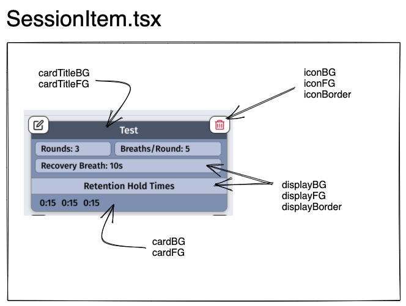

iOS application giving the user full control over a Wif Hof style breathing session.

The brains of the application is in a Finite State Machine, defined using the XState JavaScript library.

## breathMachine.ts - Finite State Machine

The breath machine is very customizable, allowing a perfect session based on the users needs.

A typical Wim Hof breathing **Session** will consist of multiple **Rounds** and each **Round** will consist of the following:

1.  **Conscious Forced Breathing** - Consistent inhales and exhales, usually in the 30-40 breath range, with a breath being the combination of an inhale and exhale.
2. **Breath Retention** - On the final exhale from step 1, you will hold your breath for as long as you can.  This will vary on the person and usually will increase as you do multiple rounds.
3. **Recovery Breath** - Once you have held your breath for as long as you could in step 2, you will take a deep breath and hold it for a recovery period.  Usually 15 seconds.

The above three steps constitute a single **Round**.  A typical breathing **Session** will consist of three to five of the above **Rounds**.

The following inputs allow you to full customize your rounds and session.

> NOTE: All inputs/times are in **milliseconds**.  Simply multiply your seconds by 1000.
>
> The default interval is 100 milliseconds, so there is no reason to add any more precision to your seconds.  I.E. 1.4, 10.5, that is the precision (tenths of a second).

### Setting Times for Breath Lengths

- **inhaleTime** - (Step 1 above) Length of inhale.  1.2 Seconds is fast, 1.6 or 1.7 is medium.
- **pauseTime** - (Step 1 above) Not needed in Wim Hof, but this would be a hold after each Inhale before the Exhale.  Just don't update this value or set it to zero to ignore.
- **exhaleTime** - (Step 1 above) Lenght of exhale. 1.2 Seconds is fast, 1.6 or 1.7 is medium.
- **defaultHoldTime** - (Step 2 above) Since you will have multiple rounds in a session, the defaultHoldTime will be the **Breath Retention** time for any round that isn't explicity defined.  We will see how to set the individual round hold times in the code sample.
- **actionPauseTimeIn** - This is a unit of time that will take place before the Recovery Hold Time starts.  This allows the user to inhale and begin the recovery hold.  2-3 seconds is good.
- **recoveryHoldTime** - (Step 3 above) Recovery breath hold time.  
- **actionPauseTimeOut** - This is a unit of time that will take place **AFTER** the Recovery Hold Time ends.  This allows the user to exhale and prepare for the next round to begin.  5-6 seconds is good.

### Configuring Rounds and Session

The timings above constitute most of the setup, however, we do need to be able to set how many Forced Breaths are to be taken and how many breath rounds will be in the session.

- **breathReps** - How many Conscious Forced Breaths to take before breath retention hold.  Usually between 30 and 40 breaths.
- **breathRounds** - How many rounds (Steps 1 - 3 above) will be included in the session.  Usually 3-4.

### Code to Update Machine Settings

The code needed to update the above machine settings have been encapsulated in the `useBreathEvents` hook located in the `\hooks\useBreathMachineHooks.ts` file.

```javascript
// breathEvents will be an object with many relevant events
const breathEvents = useBreathEvents();

// There are 2 events for updating the machine defaults:
breathEvents.updateSessionSettings({ inhaleTime: 1700, exhaleTime: 1700, ...}, true)
breathEvents.updateSessionBreathRounds({ 1: { holdTime: 30000 }, 2: { holdTime: 30000}, ... })
```

Note that for the `updateSessionSettings` function, you can pass two parameters, the first being the settings config object and the second a boolean indicating whether to clear the **sessionStats** and reset the **sessionComplete** flag.

Usualy when setting the sessions settings, you will want to do this, so if not passed the default is true.

> While there is a separate function to update the Breath Rounds, you could just as easily update them using the `updateSessionSettings` function, simply add the following:
>
> { inhaleTime: 1700, **breathRoundsDetail: { 1: { holdTime: 10000 }, ...}** }

## Alerts

Alerts are configurable items that allow the user to tell the session to "alert" the user of an event.  In the  case of this application we have a predetermined set of **Alert Events** that are configurable.

The alerts can be either a **sound** or **UI** alert or **both**.  

The `alertListener.ts` file contains the code for all the alerts.  It is imported into the `breathMachineContext.tsx` file so that the **UI** alerts can be used by any component that wants them.  The **Sound** alerts are handled() within the `alertListener.ts` file.

Below are the predetermined alerts, which are set via and object that is passed along with the session settings.

**Conscious Forced Breathing Alerts (breathing)**

- **alertEveryXBreaths** *(breathing.everyXBreaths)* - set an alert that will trigger after every X breaths.
- **alertXBreathsBeforeEnd** *(breathing.breathsBeforeEnd)* - set an alert that will trigger X breaths before the end of Conscious Forced Breathing.  If set to 5 and you are doing 30 breaths, this will trigger on the 25th breath.

 **Breath Retention Alerts (holding)**

- **alertEveryXSeconds** *(retention.everyXSeconds)* - set an alert that will trigger after every X seconds. To hear a sound every minute, this would be set to 60.
- **alertXSecondsBeforeEnd** *(retention.secondsBeforeEnd)* - set an alert that will trigger X seconds before the end of Breath Retention.  If set to 5 and retention is for 2 minutes, alert would trigger at 1:55 minutes.

**Recovery Breath Alerts (recoveryhold)**

- **alertEveryXSeconds** *(recovery.everyXSeconds)* - set an alert that will trigger after every X seconds. This may not be used much, as default recovery time is 15 seconds.
- **alertXSecondsBeforeEnd** *(recovery.secondsBeforeEnd)* - set an alert that will trigger X seconds before the end of the **Recovery Breath** .  If set to 5 and recovery is for 15 minutes, alert would trigger at 10 seconds.
- **alertBreathInPause** - set an alert that triggers when the `intropause` state is started in the breathMahcine.  It will only allow for the setting of a sound asset to be played or nothing.
- **alertBreathOutPause** - set an alert that triggers when the `outropause` state is started in the breathMahcine.  It will only allow for the setting of a sound asset to be played or nothing.

**Alert Object to Set Above** - `utils/alertTypes.ts`

```javascript
type AlertSettings = {
  ConsciousForcedBreathing: {
    alertEveryXBreaths: {
      value: number;
      sound: AlertSoundNames;
    };
    alertXBreathsBeforeEnd: {
      value: number;
      sound: AlertSoundNames;
      countDown: boolean;
      countDownSound: AlertSoundNames;
    };
  };
  BreathRetention: {
    alertEveryXSeconds: {
      value: number;
      sound: AlertSoundNames;
    };
    alertXSecondsBeforeEnd: {
      value: number;
      sound: AlertSoundNames;
      countDown: boolean;
      countDownSound: AlertSoundNames;
    };
  };
  RecoveryBreath: {
    alertBreathInPause: {
      sound: AlertSoundNames;
    };
    alertEveryXSeconds: {
      value: number;
      sound: AlertSoundNames;
    };
    alertXSecondsBeforeEnd: {
      value: number;
      sound: AlertSoundNames;
      countDown: boolean;
      countDownSound: AlertSoundNames;
    };
    alertBreathOutPause: {
      sound: AlertSoundNames;
    };
  };
};
```

### Alert Object and Hooks

The object that holds the alert information is as follows. 

Note that there alert structure is the same for all alerts, except if it is a "breathing" alert, there will be a `breath` key and if it is a "retention" or "recovery" alert, there will be a `elapsed` key.

```javascript
type BreathAlertNames = "breathing.everyXBreaths" | "breathing.breathsBeforeEnd";
type SecondsAlertNames =
  | "retention.everyXSeconds"
  | "retention.secondsBeforeEnd"
  | "recovery.everyXSeconds"
  | "recovery.secondsBeforeEnd";

export type Alert<T = SecondsAlertNames | BreathAlertNames> = {
  type: T;
  alertSound: AlertSoundNames;
  // breath number that triggered alert
  breath?: number;
  // elapsed seconds that triggered alert (milliseconds)
  elapsed?: number;
};
export type BreathAlert = Omit<Alert<BreathAlertNames>, "elapsed"> | undefined;
export type SecondsAlert = Omit<Alert<SecondsAlertNames>, "breath"> | undefined;
```

**Hooks**

You can access an triggered alerts through a couple of different hooks.  If you are using the `useBreathMachineInfo` hook, it return an **alert** object.

But you may want to just get alerts that were triggered for Breathing, Retention or Recovery events.  For these, you can use the following hooks:

```javascript
const breathAlert = useBreathAlert();
// breath alert shape:
// {
//   type: "breathing.everyXBreaths"|"breathing.breathsBeforeEnd"
//   alertSound: AlertSoundNames;
//   breath: number
// }

const retentionAlert = useRetentionAlert();
// retention alert shape:
// {
//   type: "retention.everyXSeconds"|"retention.secondsBeforeEnd"
//   alertSound: AlertSoundNames;
//   seconds: number
// }

const recoveryAlert = useRecoveryAlert();
// recovery alert shape:
// {
//   type: "recovery.everyXSeconds"|"recovery.secondsBeforeEnd"
//   alertSound: AlertSoundNames;
//   seconds: number
// }

```


### TO DO

Need to determine what good defaults should be, maybe NONE!  If not set up, then most get no defaults.  Maybe just the following:

- **ConsciousForcedBreathing.alertEveryXBreaths** = 10
- **ConsciousForcedBreathing.alertXBreathsBeforeEnd** = 2
- **BreathRetention.alertXSecondsBeforeEnd** = 5
- **RecoveryBreath.alertBreathInPause** = some sound
- **RecoveryBreath.alertXSecondsBeforeEnd** = 5
- **RecoveryBreath.alertBreathOutPause** = some sound

Need to also make sure anytime seconds is passed, we multiply by 1000, since our timer ticks by milliseconds.

How to structure text alerts to UI.  Probably need typed return values for every type of alert.  Maybe we don't need to know how may seconds, but simply that a certain type of alert was triggered.  OR, intead of a string, the payload could be a string and a value.

```javascript

```


### Alert Sounds

Sound script files are located in `\utils\sounds\`. There is a `soundTypes.ts`file which has an `AlertSoundNames` , `AlertPlayableSounds` and  `AlertSounds` type.  The `AlertSoundName` type will contain all the possible alert sound names that are loaded into an object with the type of `AlertSounds`, which will be an Expo Asset type.  

```typescript
import { Audio } from "expo-av";
import { Asset } from "expo-asset";

export type AlertSoundNames =
  | "tick"
  | "ding"
  | "gong"
  | "churchBell"
  | "breathInMark"
  | "breathOutMark"
  | "airplaneDing"
  | "elevatorDing";

export type AlertSounds = {
  [assetName in AlertSoundNames]: Asset;
};

export type AlertPlayableSounds = {
  [assetName in AlertSoundNames]: Audio.Sound;
};

```

This means, that whenever you add a new sound that is loaded.  You will need to update the AlertSoundNames type.

The `AlertSounds` type defines the object that holds all of the sounds that are loaded via a `require` statement.

The `AlertPlayableSounds` type is defining the object that holds the actual playable alert sound.

The load of the assets happen in the `utils\sounds\soundLibrary.ts` file.  

This file loads the resources via a require statement.  This object is exported/imported into the `useAlertSounds.ts` hook file and is used to load the sounds into a playable format.

This file also defines a `soundLibrary` variable, which holds details for each sound.  The `id` key MUST be the same as the corresponding sound / key in the `alertSounds` object that has *required* all the sound files.

I tried to store all this sound information in a JSON file and then read it in and do the require statements, etc, but the packager doesn't like dynamic "require" statements.  Opted for this route.

### Adding a New Sound

To add a new sound and make it available in the application, there are a few required steps and they happen in the `soundLibrary.ts` file.

- Add the sound to the `assets/sounds/` directory.
- Add the key/id of the sounds to the `AlertSoundNames` type in the `soundTypes.ts` file.
- Add the sounds require statement to the `alertSounds` object in `soundLibrary.ts`
- Add the meta data to the `soundLibrary` array, also in the `soundLibrary.ts`
  This will be the metadata for the sound.  Make sure that the **id** matches the **key** of the sound in the alertSounds object.

**soundLibrary.ts**

```typescript
// Global variable holding the Audio.Sound object (playable sounds)
let alertPlayableSounds: AlertPlayableSounds;

// Global variable holding the sounds
export const alertSounds: AlertSounds = {
  bellding_001: require("../../assets/sounds/bellding_001.mp3"),
  bellding_002: require("../../assets/sounds/bellding_002.mp3"),
  bellding_003: require("../../assets/sounds/bellding_003.mp3"),
  bellding_004: require("../../assets/sounds/bellding_004.mp3"),
  ...
};

// Sound library object.  
// You pass the "id" to the play sounds function
export const soundLibrary: SoundLibrary[] = [
  {
    id: "bellding_001",
    type: "alert",
    category: "bell",
    displayName: "Bell 1",
    fileName: "bellding_001.mp3",
    length: 2,
    volume: 1,
  },
  {
    id: "bellding_002",
    type: "alert",
    category: "bell",
    displayName: "Bell 2",
    fileName: "bellding_002.mp3",
    length: 1,
    volume: 1,
  },
  ...
 ];
```

**useAlertSounds Hook**

The useAlertSounds hook will "load" the sounds that the current session requires.  The hook has an internal state object that holds the alert sound in the expo AV module format.

It also exposes a `playSound(name)` function, which is used to play a sound during a session.

## Global Storage

Using **Zustand** as a global store.  Currently using a package called *persist* to store data to Async storage.  

I probably need to write my own, or see if persiste allows a loader to run when pulling data from storage to make sure if it is valid.

OR, just make sure my CreateNewSession function doesn't let bad data through.

### Saving Results to Storage

When a session completes `SessionFinishedStats.tsx` screen is shown.  There is a Save button that will allow the user to store the session results.  At some point, I can allow export of and/or graphing/viewing of data in the app.

**StoredSessionStats type** in **useStore.ts**

```typescript
export type StoredSessionStats = {
  statsId: string;
  sessionName: string;
  sessionDate: Date;
  sessionLengthDisplay: string;
  sessionLengthSeconds: number;
  numberOfRounds: number;
  SessionStats: SessionStats;
};

export type SessionStats = { [round: number]: SessionRoundInfo };

export type SessionRoundInfo =
  | {
      breaths: number;
      holdTimeSeconds: number;
      recoveryHoldTimeSeconds: number;
    }
  | {};
```


## Create / Edit Session


## Theme

The theming is controlled using the `themeContext.tsx` Provider and `useTheme()` exports.

The `ThemeProvider` is used in the `App.tsx` file and wraps around the `RootNav` component.

The context provider makes a `theme` object and `changeTheme(scheme)` function  available.

Currently the only time the changeTheme function is used is in the `RootNav` component.  it has a `useEffect` hook that runs whenever React Native's `useColorScheme()` hooks changes, i.e. when the users changes their phone from light to dark mode.

The Theme data also has some fields specific to React Navigation as it also has some built in support for light/dark mode.

### Accessing Theme Vars

To get access to the theme object in a component you can simply use

```javascript
const { theme } = useTheme()
```

But I like to define my styles at the bottom of my component.  To make this happen, outside of your component (but in same file), create a function that accepts the theme object and returns a React Native `styles` object using `StyleSheet.create({})`.

Since you do not want to recreate this style object everytime the component rerenders, you can wrap the calling of the function in a useMemo.

```javascript
const MyComponent = () => {
	...
  const styles = React.useMemo(() => createStyles(theme), [theme]);
}

const createStyles = (theme: Theme) => {
  const styles = StyleSheet.create({
    addButton: {
      position: "absolute",
      backgroundColor: theme.colors.primaryBG,
      bottom: 30,
      right: 20,
      borderWidth: 1,
      borderColor: theme.colors.border,
      borderRadius: 30,
      width: 60,
      height: 60,
      justifyContent: "center",
      alignItems: "center",
      zIndex: 100,
    },
  });
  return styles;
};
```


Here are how the colors map to the app items.




