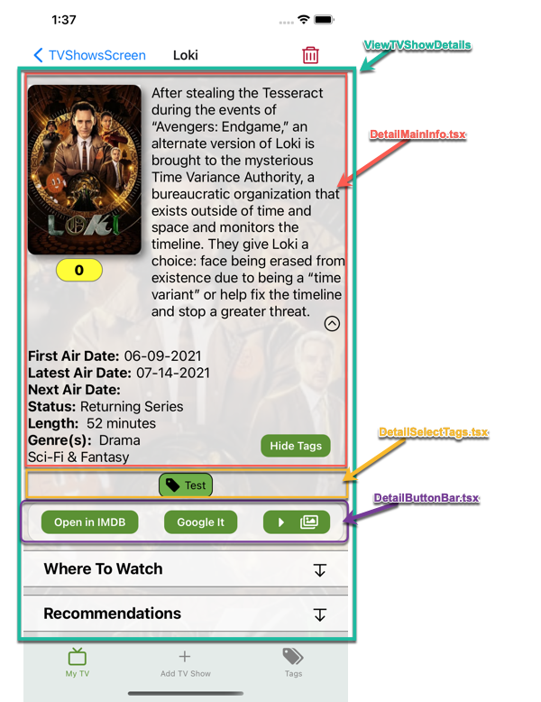

> NOTE: You may see references to movies and Movie Tracker as TV Tracker started as a fork of Movie Tracker.
>
> Some big changes in TV Tracker (No Firebase is one), but many simliarities.

## Data Structure

Data is stored internally using the Overmind library.  To persist data, we store items in local storage.

### Overmind

Data in Overmind is broken up into three distinct parts:

- **oAdmin** - login data (username, email) and app state data ( datasource: "local | firestore")
- **oSaved** - The main tv show data.  The tv shows themselves as well as settings data, tag data, etc.
- **oSearch** - When search for a tv show, this state helps us know what is being searched for and what state the load of the search data is in.

#### oSaved

- **currentSort** - current options for sorting.  The **active** property lets us know if it is being used to sort.

  > Order of the array is important.  It is the order the sort is applied
  >
  > *title, sortField, & type* fields are added when needed.  Specifically when displaying options **SectionSort** component and when filtering **getFilteredTVShows** state getter in oSaved.

  ```javascript
  [
    {
      id: number,
      index: number,
      sortDirection: desc | asc
      active: boolean
    },
    ...
  ]
  ```

- **filterData**

- **generated**

- **savedFilters**

- **savedTVShows** - tv shows saved to Overmind.

  > For most up to date type see oSaved state.ts
  
  ```typescript
  type SavedTVShowsDoc = {
    id: number;
    name: string;
    firstAirDate: DateObject;
    lastAirDate: DateObject;
    nextAirDate: DateObject;
    posterURL: string;
    genres: string[];
    avgEpisodeRunTime: number;
    status: string;
    // TV Tracker created items
    taggedWith?: string[];
    userRating: number;
    savedDate: DateObject;
  };
  ```
  
  
  
- **settings**

- **tagData**

## Date Formats Stored

When getting a date field from TMDB_API wrapper, you get a date object with a JavaScript date object, Unix Epoch time and a Formatted date field.

I am saving the Epoch and Formatted date object for every date field.  The downside is storing both date types takes up storage but not sure if it is too much, so will just leave both.

**Solution**

Since data from tmdbs_api comes in with epoch and formatted, should leave both in savedTVShows.

If it needs to be converted with `date-fns` this is the process

[date-fns format docs](https://date-fns.org/v2.22.1/docs/format)

```javascript
import { fromUnixTime, differenceInDays, format } from "date-fns";

// Convert epoch to JavaScript Date
jsDate = fromUnixTime(tvShow.nextAirDate.epoch);
// Format date ## Sunday Jul 18
format(jsDate, 'EEEE MMM dd');
// Find difference between today and another date
// Put the future date as the first parameter if first parameter
// date is a earlier date the second parameter, you will get a negative number.
differenceInDays(new Date(), jsDate)
```


## imdb App Links

In the Movie Tracker app, there are a few places where you can open up the tv show and cast members in IMDB.  I couldn't find any real documentation from IMDB on how to do this, but with some troubleshooting found out the following:

**Linking to a tv show**

If we ever get to the catch, the assumption is that they don't have the imdb app loaded on their device, so send them to the app store.

```javascript
Linking.openURL(`imdb:///title/${imdbId}`)
  .catch((err) => {
     Linking.openURL("https://apps.apple.com/us/app/imdb-movies-tv-shows/id342792525");
   }
)
```

**Linking to a Person**

```javascript
getPersonDetails(person.personId)
  .then((res) => Linking.openURL(`imdb:///name/${res.data.imdbId}`))
  .catch((err) => {
    Linking.openURL("https://apps.apple.com/us/app/imdb-movies-tv-shows/id342792525");
   }
);
```

## Tags, Tagging and Filtering on Tags

Users are able to define as many tags as they need.  This data will be stored in Overmind on the **tagData** array.  It will hold an array of objects, each object representing a single tag:

```javascript
//oSaved.tagData
[
  {
    tagId: '896456454564-54466',
    tagName: 'Watched'
  },
  ...
]
```

These tags are applied to tv shows to help the user filter tv shows later.

### Storing Tags on TV Shows

When a tv show is tagged, a new object property is added to the tv show object in the **oSaved.savedTVShows** array of objects.  This object property is called **taggedWith** and is an array of **tagIds**.

This is how we store the tags in AsyncStorage, however for easier use within the program, there is a piece of state called **oSaved.taggedTVShows** that is kept in sync with the data in the **taggeWith** property on each tv show.

The format is:

```javascript
{
  [tvShowId]: [ 'tagid1', 'tagid2', ... ],
  ...
}
// Here is an example with data
taggedTVShows: {
  13908: ["4e9070c9-fcb1-4675-8182-dc92e0891e16", "89680f2f-91a7-452e-8e5c-9a3a3fe538c4"],
  14560: ["abcegh-fcb1-4675-8182-dc92e0891e16", "25af15efd-91a7-452e-8e5c-9a3a3fe538c4"],
}
```

This piece of state is created upon load (**hyrdateStore()**) and then kept in sync when tags are added to tv shows, tags are deleted or tv shows are deleted.  The maintenance of this state is done through two functions:

- **createTaggedTVShowsObj** - This builds the initial object from the savedTVShows state
- ***maintainTaggedTVShowObj*** - This function keeps the **oState.taggedTVShows** state in sync.  It is called for these operations:
  - "deletetvshow" | "deletetag" | "addtag"

The oSaved.state.savedTVShows is kept up to date using the action **updateTaggedWithOnTVShow**

There are Overmind state functions (getters) that take these "applied" tags and convert them for use with the **TagCloud** component.

> NOTE: This is for storing and showing tags on individual tv shows.  See the **Filtering Tags** section for details on how we use tags to filter tv shows. 

The `getAllMovieTags` function accepts a tvShowId and returns a properly sorted array of tag objects in this form.  By properly sorted, I mean that we keep the tags in the order that the user has determined in the Tags tab.  

```javascript
{
  tagId,
  tagName,
  isSelected
}
```

The **isSelected** property allows the TagCloud component to know if the tag should be shown as being applied to the tv show or not.

The Overmind **actions** to save and remove tags to tv shows are `addTagToMovie` and `removeTagFromMovie` respectively.

### Filtering Tags

Using tags to filter our list of Saved Movies is done by storing the user selected filter data in Overmind at **oSaved.filterData.**  This data is NOT stored in Firestore, but is only for the users current session.  See [Saved Filters](#saved_filters) for information on filters that get stored to Firestore.

```javascript
  filterData: {
    tagOperator: "OR",
    tags: [tagIds],
    excludeTagOperator: "AND",
    excludeTags: [tagIds]
    genreOperator: "OR",
    genres: [],
    searchFilter: undefined,
  },
```

While the **tags** and **excludeTags** are separate properties in the **oSaved** store, the application uses the `getAllFilterTags` state function to return an array of objects:

```javascript
{
  tagId,
  tagName,
  tagState, // 'include' or 'exclude' or 'inactive'
}
```

The TagCloudEnhanced component will use the tagState property to determine what the next state will be.  Currently it is **inactive -> include -> exclude**.

#### FilterByTagsContainer

This component encapsulates the **TagCloudEnhanced** component and obfuscates the properties so that it can be used for both the *creation* of saved filters as well as setting and applying an on the fly filter.

**Components** using **FilterByTagsContainer**

- ViewMoviesFitlerScreen
- CreateSavedFilterScreen

## Saved Filters

> NOTE: **actions.js** - review **hydrateStore** function for "//!" Comments.  They are above code that is used to ensure old datastore worked with new code.  This should be removed at some point.

The user is able to create any number of saved filters.

They are located in Overmind at **oSaved.savedFilters** and is an Array of Objects:

```javascript
{
  excludeTagOperator: "OR"
  excludeTags: [ ]
  id:"0047fdc6-6592-436e-b3a9-9cad7327c871"
  index: 0
  name: "Mark’s"
  showInDrawer: true
  tagOperator: "AND"
  tags: [ ]
}
```

The **index** property on each savedFilter object is needed for the drag and drop sort.  However, we make sure that whenever we store the savedFilters array to Overmind, disk and Firestore that **the array is sorted by the index**.

By doing this, we do not need to sort everytime another component needs to access the saved filters in their sorted order.

## Sorting Movies

There are predefined options for a user to choose to sort their tv shows by.

Currently these options consist of:

- **User Rating** - **oState.savedMovies.userRating**
- **Movie Title** - **oState.savedMovies.title**
- **Movie Release Date** - **oState.savedMovies.releaseDate.epoch**
- **Saved Date** - **oState.savedMovies.savedDate** // Date tv show was added to users list

The data structure for each sort object is:

```javascript
{
  active: boolean, // Should it be used in sort
	id: "saveddate",
	index: 3,
	sortDirection: "desc" | "asc",
	sortField: "savedDate", //MUST be the same variable name as the field on the tv show object state
	title: "Saved Date"
	type: "date" | "num" | "str"
}
```

Currently in Overmind there are two places where this sort data is stored.

- **oState.settings.defaultSort** - contains objects for each sort option
- **oState.currentSort** - duplicate of defaultSort

Why in two places?  My thought was that the default sort would be saved to the database and would be updated via settings.  Everytime you logged in, this would be the defaultSort.

But what if a user wanted to do a quick sort change?  I thought that if **currentSort** was where the application always looked to when sorting, then you could have both options of a default sort and an on the fly sort.

Currently in **getFilteredMovies**, it is using the **oState.currentSort** to sort the tv shows.  I haven't implemented an on the fly sort yet, but hopefully this will future proof this part.

The flow when loading data from Firestore/AsyncStorage is to load to **settings.defaultSort** and then copy that to **currentSort**.

### Where Sort Happens

Currently the only time the sorting is used is in the main tv shows screen.  The function is found in **store/oSaved/state.js** and is called **getFilteredMovies**.  This getter not only sorts, but also filters based on any **tags**, **genres**, or **title** filters that the user has set.

The sort itself is performed using the lodash **orderBy** function.  This is why it is so important that the **sortField** in each sort object matches the same name in the **savedMovies** object that is being search.

## Search / Discover Movies

The "Add Movie" tab option lets you search for tv shows that you want to add to your Movie Library.

The components are located in `components\search`.  Components starting with **Discover** are the ones letting you enter criteria that will be sent to the TMDB API to get back tv shows that meet your criteria.

There are three types of "queries" that will be available from the DiscoverBottomSheet.  

- **Title Search** - Simply a search for the entered text
- **Predefined Search** - the API has some predefined searches.  
  - **Popular** - Initial search done
  - Now Playing - Too similar to Popular, need to maybe create a few predefined queries or just get rid of this and **upcoming**
  - Upcoming
- **Advanced Search** - allows the user to enter multiple search criteria.
  - **Genres** - Movie Genres.  Multiple can be selected.  ANDed together for search
  - **Release Year** - The year the movie was released
  - **Watch Providers** - Netflix, Amazon Prime, Hulu, etc. Multiple can be selected.  ORed together for search

To manage the search flow, the MovieMachines.js file contains an XState machine


It is made up of two primary states, **Simple** and **Advanced**.  The Simple state has two sub states, either **predefined** or **title**.  

When the machine is initially invoked, the search will be in the predefined state initially, if the user types anything in the input box, the machine will move into the **title** state and start searching on the typed input.

When the **advanced** state is invoked, no search will happen until some criteria are chosen.

The PERFORM_SEARCH event will invoke the async search action within Overmind.  

`overmind.actions.oSearch.queryMovieAPIWithConfig()` function will debounce any input for 500 milliseconds before performing any search. 

### Component Used in Searching for Movies

The **SearchStack.js** contains the main **SearchScreen.js** component as well as the **DetailsFromSearch.js** and **DetailsFromPerson.js** screen components.

**SearchScreen.js** will show the result list of tv shows returned from the search and the **DiscoverBottomSheet.js** component.  This is the component that incorporates the above state machine to coordinate the searches.

## Detail View of TV Show

The details view of a TV Show is very complex.

The **ViewTVShowDetails.tsx** component contains other components that show the details for the TVShow.

> NOTE: Some items only show if the TVShow is saved.  Specifically, the User Rating, Tags and being able to choose a different Poster Image.



The **Hide Tags** button exists in the **DetailMainInfo.tsx** component, however, it controls whether the **DetailSelectTags.tsx** component is visible.

The **Where To Watch**, **Recommendations** and other items are in **HiddenContainer** components so that the user can show and hide them.

## Calculated Metadata - Auto Updating

Status field options, returned from TV Details call:

```javascript
status = ['Returning Series', 
          'Planned', // first, last and next air dates will be undefined
          'In Production', 
          'Ended', 
          'Canceled', 
          'Pilot']
```

I want to calculate metadata upon loading the saved TV Shows from storage (as well as when we save a TV show to storage) that will do a couple of things:

1. Determine if this TV Show needs to be updated from the API
   Naturally, this will only happen during the **hydration** or loading phase of TV Shows from storage.
2. Add some metadata that will help inform how to build the interface.  Examples:
   - If First and Last air date are equal AND next air date is null and more than 1 episode in the current season, then this is a show that released all episodes at once.  Does anyone care?  Maybe an indicator that all episodes have been released.
   - If Next air date is null AND status is not "Ended", "Cancelled", (maybe also In Produciton and Planned) then do we show or calculate a **Days from Last Episode** field?  This may let people run a query to show all shows NOT OVER and with Days from Last Episode > x days.  So if I'm looking for shows on my list that might be starting up again, show me stuff that hasn't had anything new in the last 180 days.

### Determine When and What ShowsTo Update

```javascript
if tvShow.status !== 'Ended' OR 'Canceled' then
	if Next Air Date >= Today then
		add show to update list

```

## Episode State

Episode state is persisted via Async Storage in **oSaved.savedTVShows** .

**tempEpisodeState** will be used to *inform* the UI of the Episode State.  This is created during Hydration, based on what was stored in **oSaved.savedTVShows.episodeState**.

We do this because **savedTVShows** is an Array, but **tempEpisodeState** is on object the tvShowId as the key.  Not sure if this style of lookup is more performant than just looking up tvshow, but this is the way I'm doing it.

**tempEpisodeState** is accessed in 

-  state.oSaved.**getTVShowEpisodeState** - getter that returns boolean based on tvShowId, seasonNumber and episodeNumber.

- actions.oSaved.**toggleTVShowEpisodeState** - toggles the episode state.  

  This function updates the **tempEpisodeState** and then calls the oSaved.internal.**updateEpisodeStateOnTVShow** function that uses the tempEpisodeState[tvShowId] to update savedTVShows.
  It also "merges" the episode state into savedTVShows.episodeState.

  This function also checks to see if we need to ask user if previous episodes should be marked as watched.  
  It does this by returning a boolean so UI can react to the information.

  > Wonder if something like a Portal could be triggered via a state flag??

- actions.oSaved.**markAllPreviousEpisodes** - Called from UI if user wants to mark all previous episodes as watched.  Takes in tvShowId, seasonNumber, episodeNumber.
  Similar to the toggle function, this one first updates tempEpisodeState and then savedTVShows.episodeState and then saves to async Storage.
  This function calls ***buildEpisodesToMarkObj*** function, which will recurse through tempSeasonsData based on a season and episode and return an object that can be merged into tempSeasonsData.

**Flow**

- **App Startup** - **hydrateStore** will run and populate tempEpisodeState from savedTVShows.episodeState. Create a structure similar to the taggedTVShows object in oSaved.  It will be:

  ```javascript
   { 
     [tvShowId: number]: {
       [season-ep: string]: boolean
     },
     ...
   }  
  ```

  

- **Toggle State** - Whenever an episode state is toggled, the ***toggleTVShowEpisodeState*** action will need to update the appropriate state and then store to Async Storage

- **Mark Prev Episodes** - When a user opts to mark all previous episodes, the ***markAllPreviousEpisodes*** action will run.  This action also updates appropriate state and Async Storage

### UI for Seasons/Episode data

There will be a **View Seasons** button (or some UI object) in `ViewTVShowDetails.tsx` that will navigate to `DetailSeasonsScreen.tsx`.

- `ViewTVShowDetails.tsx` - The button on this screen will navigate to another screen passing the following parameters:
  - **tvShowId** 
  - **seasonNumbers** - an array of season numbers
  - **logo** - { showName: string, logURL: string } - Right now a show name, but maybe in the future an image URL
- `DetailSeasonsScreen` - 
- `DetailSeasons.tsx` - 
- `DetailSeasonEpisode.tsx` - 

