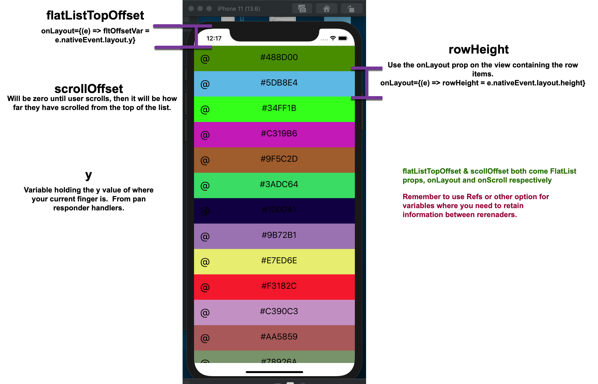
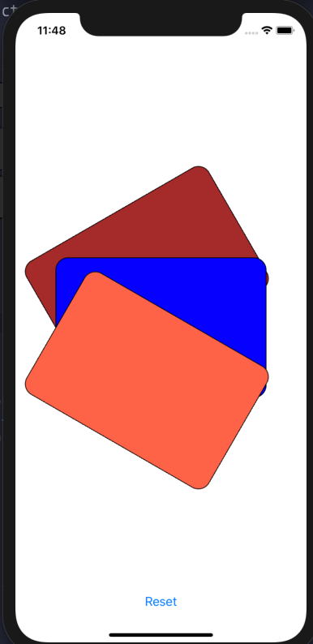
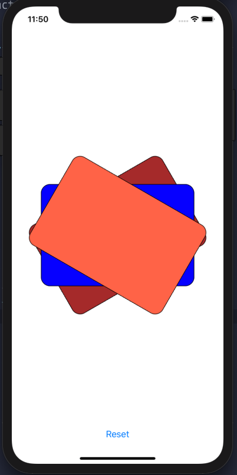

## Expo App Using ReAnimated

This will take you through setting up an application to use the Reanimated animation library as laid out by William Candillon from [start-react-native.com](start-react-native.com)

### Create your project

First you need create your project.  The command below will invoke expo to create a project.

It will ask what type of project, simply choose one.  

```bash
$ npx expo-cli init name-of-project
$ cd name-of-project
```

### Modify the tsconfig.json

This is a link to the tsconfig that William Candillon uses

[tsconfig additions](https://github.com/wcandillon/react-native-gestures-and-animations-workshop/blob/master/tsconfig.json)

The are the additional items that can be added to the default.

```json
    "noImplicitAny": true,
    "strictNullChecks": true,
    "strictFunctionTypes": true,
    "strictPropertyInitialization": true,
    "noImplicitThis": true,
    "alwaysStrict": true,
    "noUnusedLocals": true,
    "noUnusedParameters": true,
    "noImplicitReturns": true,
    "noFallthroughCasesInSwitch": true,
    "forceConsistentCasingInFileNames": true
```

### eslint add ons

```bash
$ yarn add eslint eslint-config-react-native-wcandillon --dev

NOT SURE about these @react-native-community/eslint-config eslint-plugin-import
```

### Create .eslintrc

add the following to .eslintrc

```json
{
  "extends": "react-native-wcandillon"
}
```

### eslint scripts

Change in `package.json` the "lint" script and change the max warnings:

```json
    "lint": "eslint --ext .ts,.tsx .",
    "tsc": "tsc",
    "ci": "yarn lint && yarn tsc"
```

### React Navigation / Reanimated / gesture handler / Redash

Here is the basics need for react navigation

```bash
//# Redash is a utility application that is used in reanimated animations
$ yarn add react-native-redash
//# Just the base React Navigation V5 installs
$ yarn add @react-navigation/native @react-navigation/stack
//# Reanimated and the gesture handler
$ expo install react-native-gesture-handler react-native-reanimated 
//# some other installes that are useful
$ expo install react-native-screens react-native-safe-area-context @react-native-community/masked-view
//# 
$ expo install expo-asset expo-font expo-constants
```

## Reanimated Transitions

[Reanimated Docs For Transitions](https://docs.swmansion.com/react-native-reanimated/docs/transitions)

## Reanimated Timing Animations

These would be animations where you need a value to vary over time so that you have animate a style property to animate it.

For simple animations, using the React Native Animation API would probably be easier, but the Reanimated API does allow for more robust transitions.

I'm sure this will all change in v2, but here goes.

First thing, here are the common imports you will need for just about any timing animation:

```javascript
import Animated, { Easing, interpolate } from "react-native-reanimated";
import { useClock, useValue } from "react-native-redash";

const {
  Clock,
  Value,
  useCode,
  set,
  block,
  cond,
  startClock,
  stopClock,
  clockRunning,
  and,
  not,
  eq,
  timing,
} = Animated;
```

[**react-native-redash**](https://wcandillon.github.io/react-native-redash/) has some utilities that make some things easier.  The primary ones are the **useValue** and **useClock**.  These create new Value and new Clock, with the added benefit that they will keep their identiity across component re-renders.  This is easier than using a Ref or Memo.

Here is a sample code that animates a circle getting larger and then smaller.

```jsx
import React, { useState } from "react";
import { StyleSheet, View } from "react-native";
import Animated, { Easing } from "react-native-reanimated";
import { useClock, useValue } from "react-native-redash";

import { Button, StyleGuide } from "../Components";

const {
  Clock,
  Value,
  useCode,
  set,
  block,
  cond,
  startClock,
  stopClock,
  clockRunning,
  and,
  not,
  eq,
  timing,
} = Animated;

const styles = StyleSheet.create({
  container: {
    flex: 1,
    justifyContent: "space-between",
    backgroundColor: StyleGuide.palette.background,
  },
  redblock: {
    backgroundColor: "red",
    width: 100,
    height: 100,
  },
  circle: {
    width: 100,
    height: 100,
    borderRadius: 50,
    borderColor: "black",
    borderWidth: 1,
  },
});

// This is called every frome I believe
// It returns an animation value that we can then use to transform a View or other Component
const runTiming = (clock) => {
  // The timing function requires a clock, a state object and config object
  // These could be imported or set outside this function for performance.
  // We modify these objects in the block that we return.
  const state = {
    finished: new Value(0), // indicator of whether we are finished or not
    position: new Value(0), // current position of animation node (usually what we are looking to be as final return value)
    frameTime: new Value(0),
    time: new Value(0),
  };
  const config = {
    toValue: new Value(1), // our final value we are moving to
    duration: 3000, // how long in ms to get from starting position to toValue
    easing: Easing.inOut(Easing.ease), // easing function
  };
  // The block is a block of code to execute 
  // the last item in the array is what is returned
  // first condition -> clock is NOT running, THEN set state.time = 0 ELSE run timing function
  // second condition -> if state.finished === 1 (i.e animation is finished), THEN execute a block of code in [ ]
  // these sets pretty much reset everything so that when the clock starts again, the animation picks up where it left off.
  // last piece of code is just state.position and this is then the return value.
  return block([
    cond(
      not(clockRunning(clock)),
      set(state.time, 0),
      timing(clock, state, config)
    ),
    cond(eq(state.finished, 1), [
      set(state.finished, 0),
      set(state.time, 0),
      set(state.frameTime, 0),
      set(config.toValue, cond(eq(state.position, 1), 0, 1)),
    ]),
    state.position,
  ]);
};
const MyTiming = () => {
  const [play, setPlay] = useState(false);
  const clock = useClock();
  const scale = useValue(0);
  // If you didn't need to start and stop, this would be the one line of code that would start 
  // the animation
  // useCode(() => [startClock(clock), set(scale, runTiming(clock))], []);
  // Need a animation value node that will be 0 (off) or 1 (on)
  const isPlaying = useValue(0);
  // set isPlaying based on the state value of play
  // notice the useCode hook has a dependancy array so that it is only run if play changes.
  useCode(() => set(isPlaying, play ? 1 : 0), [play]);
  // This is what controls the animation
  // first condition -> isPlaying (true) and clock NOT running, then start clock (startClock is from Animated)
  // second condition -> isPlaying (false) and clock IS running, then stop clock (stopClock is from Animated)
  // last part of block -> set the scale value based on what the runTiming function returns
  useCode(
    () => [
      cond(and(isPlaying, not(clockRunning(clock))), startClock(clock)),
      cond(and(not(isPlaying), clockRunning(clock)), stopClock(clock)),
      set(scale, runTiming(clock)),
    ],
    []
  );

  return (
    <View style={styles.container}>
      <View style={{ flex: 1, justifyContent: "center", alignItems: "center" }}>
        <Animated.View
          style={[
            styles.circle,
            {
              transform: [
                {
                  scale: scale.interpolate({
                    inputRange: [0, 1],
                    outputRange: [1, 4],
                  }),
                },
              ],
            },
          ]}
        ></Animated.View>
      </View>
      <Button
        label={play ? "Pause" : "Play"}
        primary
        onPress={() => setPlay((prev) => !prev)}
      />
    </View>
  );
};

export default MyTiming;
```

**Using React Native's Animation**

```jsx
import React, { useState } from "react";
import { StyleSheet, View, Animated, Easing } from "react-native";

import { Button, StyleGuide } from "../Components";

const styles = StyleSheet.create({
  container: {
    flex: 1,
    justifyContent: "space-between",
    backgroundColor: StyleGuide.palette.background,
  },
  redblock: {
    backgroundColor: "red",
    width: 100,
    height: 100,
  },
  circle: {
    width: 100,
    height: 100,
    borderRadius: 50,
    borderColor: "black",
    borderWidth: 1,
  },
});

const MyTiming = () => {
  const [play, setPlay] = useState(false);
  const [toValue, setToValue] = useState(1);
  const animScale = new Animated.Value(0);

  const outBreath = () =>
    Animated.timing(animScale, {
      duration: 3000,
      easing: Easing.inOut(Easing.ease),
      toValue: 1,
      useNativeDriver: true,
    }).start(inBreath);
  const inBreath = () =>
    Animated.timing(animScale, {
      duration: 3000,
      easing: Easing.inOut(Easing.ease),
      toValue: 0,
      useNativeDriver: true,
    }).start(outBreath);
  outBreath();

  return (
    <View style={styles.container}>
      <View style={{ flex: 1, justifyContent: "center", alignItems: "center" }}>
        <Animated.View
          style={[
            styles.circle,
            {
              transform: [
                {
                  scale: animScale.interpolate({
                    inputRange: [0, 1],
                    outputRange: [1, 4],
                  }),
                },
              ],
            },
          ]}
        ></Animated.View>
      </View>
      <Button
        label={play ? "Pause" : "Play"}
        primary
        onPress={() => setPlay((prev) => !prev)}
      />
    </View>
  );
};
export default MyTiming;
```

## Animated.event()

The purpose of Animated.event() is to set Animated.value nodes by mapping data from parameters passed in.  Usually this is the native Event, but in the case of the Pan Responder, it would be both.

```javascript
//The first parameter is an array of mappings.  This array will correspond to the number of arguments that will be
//passed into the function that Animated.event creates.  Usually this is just the native event, but many of the Pan Responder callbacks will pass (event, gestureState).
//Found that in the Pan Responder, useNativeDriver set to true gave errors.

Animated.event([{...}, {...}, ...], { listener: fn, useNativeDriver: false | true})
```


## Pan Responder

The Pan Responder is the gesture handler that comes with React Native.  I find it a bit easier to use than the Pan Gesture Handler from the Reanimted folks.


### Drag and Drop Flatlist

Using the Pan Responder to build a drag and drop FlatList.

There are a number of measurements you will need to help you calculate everything.



#### Scrolling list automatically

As the item you are moving gets closer to the top or bottom, you will want to have the list start to scroll automatically.

This is done via the **scrollToOffset()** function that is available to the FlatList.  To use it, you will need to create a ref and assing the FlatList to it.

Then, in the **animateList** function, you can check how close you are to the top or bottom of the flatlist and scroll based on this:


## Gesture Handlers - Reanimated

[Pan Gesture Handler Docs](https://docs.swmansion.com/react-native-gesture-handler/docs/handler-pan)

You will need to make sure you have installed this using:

```bash
$ expo install react-native-gesture-handler
```

In your code you will use the following import:

```javascript
// PanGestureHandler is a components and State are contants that we can compare to the real state.
import { PanGestureHandler, State } from "react-native-gesture-handler";
```

To use the *PanGestureHandler* you will need to wrap it around the component(s) you want to control/capture gestures for.

Here is an example:

**Capture Gestures**

```jsx
<PanGestureHandler
	onHandlerStateChange={myGestureEvent}
	onGestureEvent={myGestureEvent}
>
	<Animated.View
		style={{
			transform: [{ translateX }, { translateY }],
		}}
	>
		<Card />
	</Animated.View>
</PanGestureHandler>
```

Most likely the view inside will be an **Animated.View** as you probably want to move something with the gesture.

You will need to properties on the **PanGestureHandler** to capture and use the gestures movement.

**onHandlerStateChange**, **onGestureEvent**

Can't find a clear definition of what they are, but if you want to move something, you need them both.  **myGestureEvent** is defined as an Animated event.  What I can tell with an Animated.event is that they map what the handler returns to variables which can then be used in translations to move a view.

### Redash Helper for PanGestureHandler

The *react-native-redash* package has a helper that returns all the event handlers needed by the PanGestureHandler.

**Import and Use onGestureEvent**

```jsx
import { onGestureEvent } from "react-native-redash";
...
// This is from redash and would take care of the long hand way we did things
// <PanGestureHandler {...gestureHandler}> ... </PanGestureHandler>
const gestureHandler = onGestureEvent({
  state,
  translationX,
  translationY,
});
...
return (
  <View style={styles.container}>
    <PanGestureHandler {...gestureHandler}>
      <Animated.View
        style={{
          transform: [{ translateX }, { translateY }],
        }}
      >
        <Card />
      </Animated.View>
    </PanGestureHandler>
  </View>
);

```

We are just spreading the return object from the **onGestureEvent**.

Here is the full example that shows how to get a card to move on the screen while saving the last value it was at when the gesture stopped.  This lets the movement pick up where it left off.

```jsx
import React from "react";
import { StyleSheet, View, Dimensions, Text } from "react-native";
import { PanGestureHandler, State } from "react-native-gesture-handler";
import Animated, { block, multiply } from "react-native-reanimated";
import { diffClamp, onGestureEvent } from "react-native-redash";

import Card from "../useTransition/Card";

const { Value, cond, set, eq, add, event } = Animated;
const { width, height } = Dimensions.get("window");

const withOffset = (
  value: Animated.Value<number>,
  state: Animated.Value<State>
) => {
  const offset = new Value(0);
  return cond(
    eq(state, State.END),
    [set(offset, add(offset, value)), offset],
    add(offset, value)
  );
};
const PanGesture = () => {
  const state = new Value(State.UNDETERMINED);
  const translationX = new Value(0);
  const translationY = new Value(0);
  const CARD_WIDTH = 300;
  const CARD_HEIGHT = 200;
  0;
  // This is from redash and would take care of the long hand way we did things
  // <PanGestureHandler {...gestureHandler}> ... </PanGestureHandler>
  const gestureHandler = onGestureEvent({
    state,
    translationX,
    translationY,
  });

  // Long hand way to create the event
  // the event (Animated.event) maps the values in the inner object
  // to those variables for use in styles to transform (move) a view
  const myGestureEvent = event([
    {
      nativeEvent: {
        state,
        translationX,
        translationY,
      },
    },
  ]);
  const translateX = diffClamp(
    withOffset(translationX, state),
    0,
    width - CARD_WIDTH
  );
  const translateY = diffClamp(
    withOffset(translationY, state),
    35,
    height - CARD_HEIGHT
  );
  return (
    <View style={styles.container}>
      <PanGestureHandler {...gestureHandler}>
        <Animated.View
          style={{
            transform: [{ translateX }, { translateY }],
          }}
        >
          <Card />
        </Animated.View>
      </PanGestureHandler>
    </View>
  );
};

export default PanGesture;

const styles = StyleSheet.create({
  container: {
    flex: 1,
    backgroundColor: "#ccc",
  },
});
```

**Some Notes**

The **diffClamp** function sets boundaries for your values.  Here that would be the translateX and translateY values.

> Use the **diffClamp** from **redash** and NOT reanimated.

From what I can tell the translateX and Y values of a view are the **top left** of the container.


## ForceGestureHandler - Reanimated

The force gesture handle is for iOS only.

You will need to provide two functions

- onGestureEvent

- onHandlerStateChange - When the state changes this will run.  These are the state from the State enum import

  `*import* { State, ForceTouchGestureHandler } *from* "react-native-gesture-handler";`

  - State.UNDETERMINED = 0
  - State.BEGAN = 2
  - State.ACTIVE = 4
  - State.END = 5

Here is the nativeEvent Object returned by this handler:

```javascript
nativeEvent {
  "absoluteX": 46,
  "absoluteY": 398,
  "force": 0.4475,
  "handlerTag": 49,
  "numberOfPointers": 1,
  "oldState": 4,
  "state": 5,
  "target": 4067,
  "x": 31,
  "y": 51,
}
```


```jsx
import React from "react";
import { StyleSheet, Text, View, Animated } from "react-native";
import { State, ForceTouchGestureHandler } from "react-native-gesture-handler";

const SetUserRating = (props) => {
  const force = new Animated.Value(0);
  const [fork, setFork] = React.useState(0);
  const _onGestureEvent = (event) => {
    force.setValue(event.nativeEvent.force);
    setFork(event.nativeEvent.force);
    if (event.nativeEvent.force > 0.5) {
      props.setShowUserRating(true);
    }
  };
  // Animated.event(
  //   [
  //     {
  //       nativeEvent: {
  //         force: force,
  //       },
  //     },
  //   ],
  //   { useNativeDriver: true }
  // );
  // const _onGestureEvent = Animated.event(
  //   [
  //     {
  //       nativeEvent: {
  //         force: force,
  //       },
  //     },
  //   ],
  //   { useNativeDriver: true }
  // );

  const _onHandlerStateChange = (event) => {
    console.log(event.nativeEvent);
    console.log(State.ACTIVE, State.UNDETERMINED, State.BEGAN, State.END);
    if (event.nativeEvent.oldState === State.ACTIVE) {
      force.setValue(0);
      setFork(0);
      // props.setShowUserRating(false);
    }
  };
  return (
    <View>
      <ForceTouchGestureHandler
        feedbackOnActivation
        onGestureEvent={_onGestureEvent}
        onHandlerStateChange={_onHandlerStateChange}
      >
        <Animated.View
          style={[styles.box, { transform: [{ scale: Animated.add(1, force) }] }]}
        >
          <Text>{fork}</Text>
        </Animated.View>
      </ForceTouchGestureHandler>
    </View>
  );
};

export default SetUserRating;

const styles = StyleSheet.create({
  box: {
    width: 50,
    height: 50,

    backgroundColor: "mediumspringgreen",
    margin: 10,
    zIndex: 200,
  },
});

```


## CSS Overlays

Many times you will want to line up objects on top of one another.  The stanard style in React Native to do this is:

```javascript
styles = StyleSheet.create({
  overlay: {
		position: "absolute",
    top: 0,
    bottom: 0,
    right: 0,
    left: 0,
  }
})
```

This is used so often, React Native has a helper for it. `StyleSheet.absoluteFillObject`. It returns the exact object from above, so you can spread it in your styles variable.

```javascript
styles = StyleSheet.create({
  overlay: {
		...StyleSheet.absoluteFillObject
  }
})
```

### Rotating Overlayed Views

This can be applied to a number of different things and not just overlayed views.  It shows how the transform array in a style is applied.

It looks like it is in the order that the transforms are specified.  Below we have three cards that are overlayed.  We rotate them with this code and get:

```jsx
<View style={styles.container}>
  // Cards is an array with 3 empty values so that we get 3 cards.
      {cards.map((id, i) => {
    	 //directions lets us dynamically assign a different angle for each card.
        let direction = 0;
        if (i === 0) {
          direction = -1;
        } else if (i === 2) {
          direction = 1;
        }
        const rotate = direction * (toggled ? Math.PI / 6 : 0);

        return (
          <Animated.View
            key={i * id}
            style={[
              styles.overlay,
              {
                transform: [
                  { translateX: -150 },
                  { rotate: rotate + "rad" },
                  { translateX: 150 },
                ],
              },
            ]}
          >
            <Card index={i} />
          </Animated.View>
        );
      })}
      <View style={{ marginBottom: 40 }}>
        <Button
          title={toggled ? "Reset" : "Start"}
          onPress={() => setToggled(toggled ? 0 : 1)}
        />
      </View>
    </View>
  );
```



However, if you did not apply the translateX transforms you would get this:



So the translateX moves the axis that the rotation will be performed around