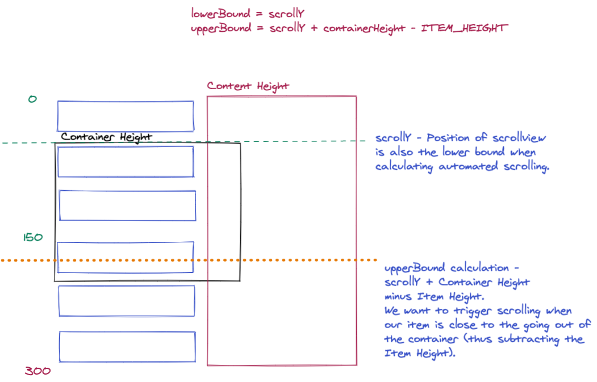

# Drag and Drop with Reanimated 2

Trying to encapsulate this functionality into something could be put into an npm package.

## Base Components

These are the components used to facilitate the dragging and dropping.

- **DragDropEntry.tsx** - Layout component.  This is the entry point. It contains a ScrollView that will contain the drag/drop items.
- **MovieableItem.tsx** - Contains the logic for moving via Reanimated and Pan Gesture handler

Both of these components need precise information about the size of the scrollview and the item height.

If the height of the Scrollview is greater than the avaible screen size, then you won't be able to scroll to those items.

To get this information, in the **DragDropEntry.tsx** file, on the ScrollView, I set a state variable called **containerHeight** using the **onLayout** prop of the ScrollView:

```jsx
<Animated.ScrollView
	ref={scrollViewRef}
	onScroll={handleScroll}
	scrollEventThrottle={16}
	style={{ width: 200, borderWidth: 1, borderColor: "red" }}
	onLayout={(e) => {
  	setContainerHeight(e.nativeEvent.layout.height);
	}}	
	contentContainerStyle={{height: items.length * ITEM_HEIGHT}}
  > 
  ... 
</Animated.ScrollView>
```

Notice in the above that we also set teh **contentContainerStyle** and set the height to the number of items times the ITEM height.  This ensures that the content area of the scrollview can accomodate all of the items.  

> NOTE: The content height is the height of all of the content of the scroll view.  Contrast this to the containerHeight set in the onLayout.  containerHeight is the visible height of the ScrollView.

Here is a visual of these heights:




## Props Needed for Each Component

**DragDropEntry**

- **items/data** - Hopefully won't need, but probably will.  this is the array of data that will be displayed.  Will need to have and **id** and most likely a **position** key.  However, I would like to allow this component to simply get an array and rearrange it.

- **type** - Only needed if we are going to allow both object and array reordering methods.  If type is "array", then I don't think anything special will be needed.  But if "object", then will need the above mentioned id and position keys in **items/data** prop.

- **updatePositions** - function that will run after drop that will reorder/update positions.  It will be passed the positions array of objects:

  ```javascript
  positions = {
    id1: 3,
    id2: 1,
    id3: 2,
    id4: 0
  }
  ```

- **getScrollFunctions** - function the passes scroll function so calling component can scroll list to start or end.

  - Implementation:

  - ```jsx
    const [scrollFunctions, setScrollFunctions] = React.useState<ScrollFunctions>();
    ...
    <DragDropEntry
        getScrollFunctions={(functionObj) => {
          setScrollFunctions(functionObj);
        }}
        ...
    > ... </DragDropEntry>
    ```

  - Now, the **scrollFunctions** variable can call the following:

  - **scrollFunctions.scrollToEnd** or **scrollFunctions.scrollToStart**

  


**MoveableItem**

- **id** - id of the item to display.

- **scrollY** - Shared Value relaying the scrollY position of the scrollview.

- **scrollViewRef** - Ref to the scrollview so that we can use the **scrollTo** function to programatically scroll.

- !**numberOfItems** - How many items in the list.  Since we are positioning the items based on height and calculating where they should reside based on their position * height, we need this to determine what the content height is going to be.  Used in determining the boundY, scrollLeft when scrolling down, etc.

  > Can this be inferred by counting the children elements.
  >
  > YES - **childCount** is calculated in a useMemo in DropDrop and passed as numberOfItems

- **positions** - Shared Value that holds an array of object lettting us know which position every item is in.
  Needs to be an array with all the items positions since the reordering of these objects (via changing the value associated with the key/id) is set to all items so that they can update their position appropriately if they were moved.

  ```typescript
  export type Positions = {
    [key: string]: number;
  };
  ```

- **containerHeight** - Height of the ScrollView that is containing the items.  It is used in the calculation of the upperBound when scrolling towards the end of the list (essentially down the list)

- **updatePositions** - Function that will update the positions in the base array of data.  Also found this could just reorder the array.  This will need more testing.
  
- **children** - 

## What the Components Do

### DragDropEntry

### MoveableItem

Every item is wrapped in a **MoveableItem** component.  Inside this component, we define the animation needed to reorder the items as an item is moved (dragged) to a new position.  

This is also where the Pan Gesture Handler is wrapped around the **Handle** component.

**Moving Item**

The moving item can have certain properties changed so that we know it is moving.  These "styles" are applied using the **useAnimatedStyle** hook from reanimated 2.

- zIndex - This makes sure our moving item is on top of all the others.

- shadow - makes our item look like it is selected

  ```javascript
        shadowColor: "black",
        shadowOffset: { height: 0, width: 0 },
        // borderWidth: 1,
        shadowOpacity: withSpring(moving.value ? 1 : 0),
  ```

- transforms - Obviously we will be modifying the **translateY** value as it is what positions the item.  But we could also scale the item with **scaleX & scaleY**

  > BEWARE: if you use **scaleY**, your translateY value will be a bit off.  I recommend not using it, but if you do, you will need to update every place that translateY is set and multiply it by the scaleY value that you used.

- 


# Main Drawing


