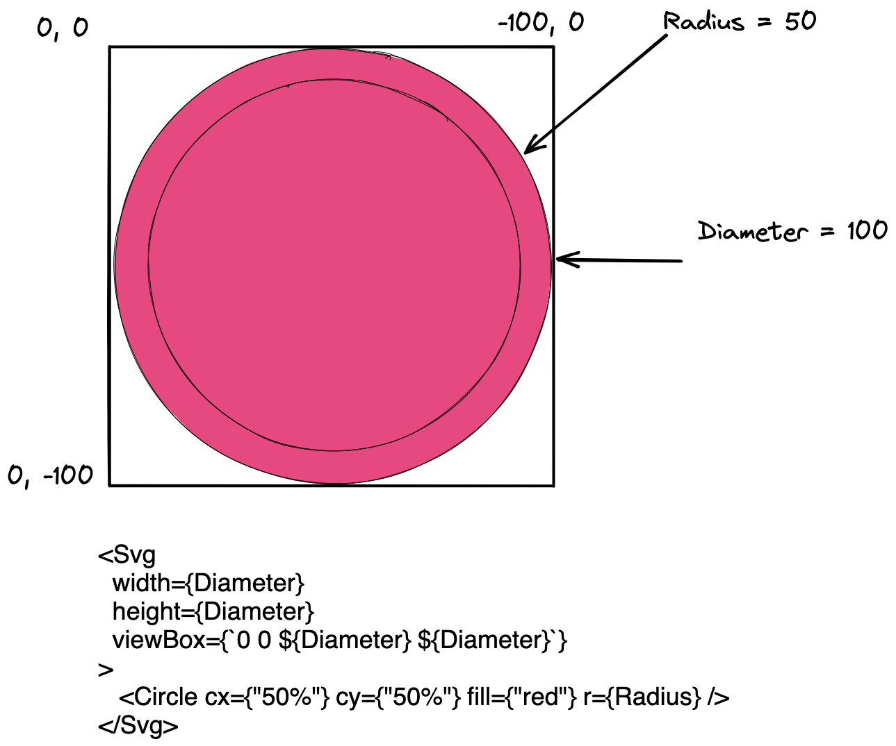
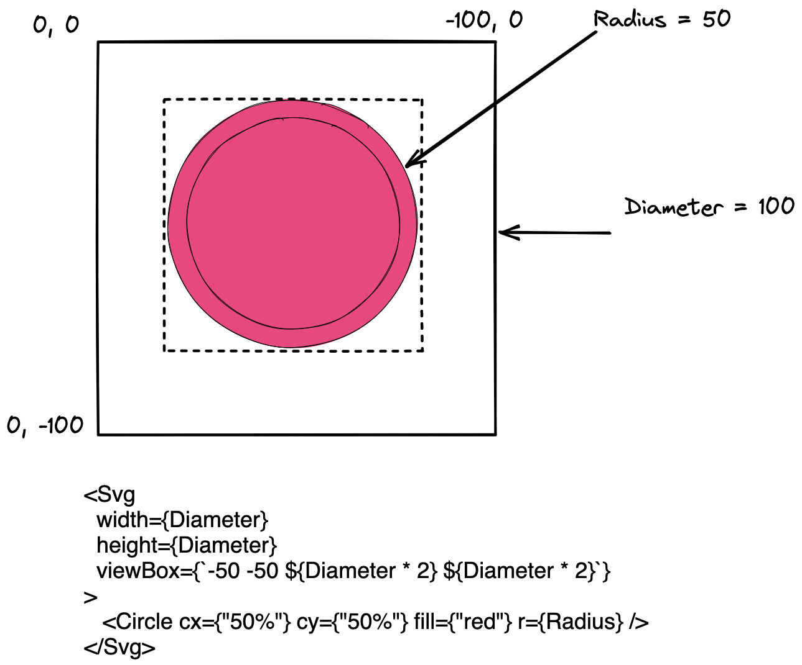
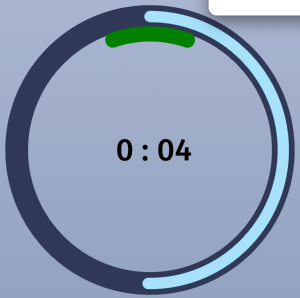
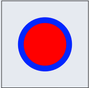
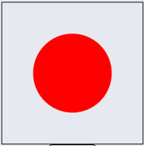
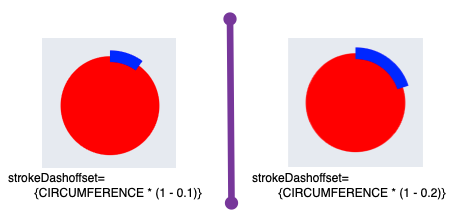
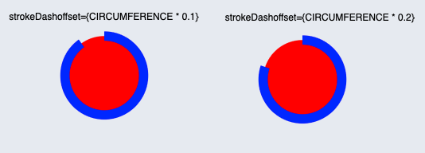
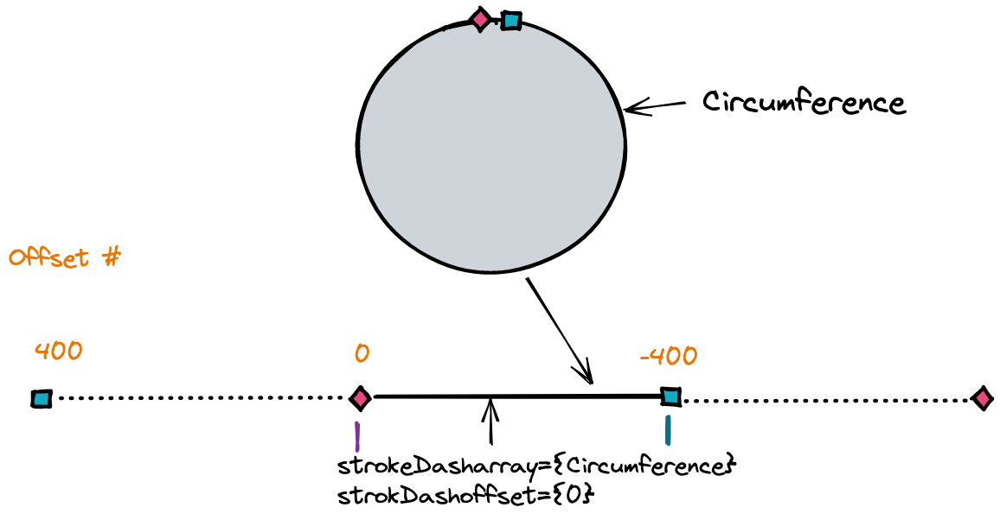
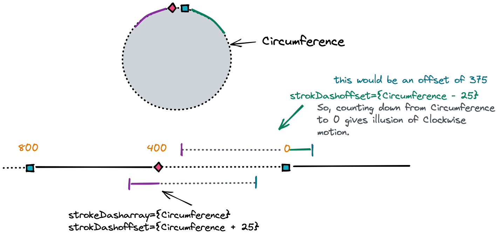

[React Native SVG Docs](https://github.com/react-native-svg/react-native-svg)

You can do a lot of shit with SVGs, but they have a learning curve and I wasn't sure where to start.  So this is a erratic compilation of things I found useful.

## Svg Component

But, first things first, enclose you svg items in an **Svg** component

```jsx
<Svg
  width={MAIN_DIAMETER}
  height={MAIN_DIAMETER}
  viewBox={`0 0 ${MAIN_DIAMETER + STROKE_WIDTH * 2} ${MAIN_DIAMETER + STROKE_WIDTH * 2}`}
  style={{ borderWidth: 1 }}
> 
  ...
</Svg>
```

The **width, height and viewBox** are super important concepts.  This [article](https://webdesign.tutsplus.com/tutorials/svg-viewport-and-viewbox-for-beginners--cms-30844) and [video](https://www.youtube.com/watch?v=6LCUStriM_o&t=686s) are a great resource.

The **width and height** attribute are known as the **View Port**. It will give your svg a place to be viewed through.  

For use with the Circle, your width and height will be the space that you want the Circle to take up on the screen. 

The **viewBox** allows you to pan and zoom across your svg.

We will only be using the viewBox to reiterate the size of our viewPort.  

The **viewBox** takes 4 space or comma separated values

- **min x** - position of the top left  x value
- **min y** - position of the top left most x value
- width - zoomed in or out width.  If larger than the width property on Svg component then, we will be zooming out
- height - zoomed height.

**Example 1**



This the basic set up to make your SVG fit inside your viewport.  The viewBox is not panning or zooming.


This show that we are zoomed OUT.  This was done by doubling the viewBox width and height.

> NOTICE that to move the circle to the center, we had to change the minx and miny value AND notice the direction is a negative value.



> 
>
> When you have a stroke, it is applied as a center stroke. You must account for this stroke in your viewBox.  Most examples I see set the Width/Height to the dimensions of the SVG and then add in any Stroke Width in the viewbox properties.


## Circles

Using the standard Circle svg component from react-native-svg is very useful for donut charts and animated timer displays:



You can animate the Stroke and get a nice effect.

Getting there is a bit involved.

All svgs have a set of **Stroke** properties that allow you to give color and width to the circle's stroke.

First, all SVGs must be wrapped in the **Svg** component.  Further, if you have multiple SVGs that "go together", you can group them using the **G** component from `react-native-svg`.

One common use for the **G** component would be if you had multiple items that were all oriented the same.  You could put them in a group and then just do a single transform on the group.

For example, the SVG Circle's stroke doesn't not start at the top of the circle, but instead at 3 o'clock on the circle.  If you want it to start at the top you need to rotate it.  

You can rotate a single Circle or if you have multiple Circles, you could group them and rotate the group.

### Rotation of Circle

The two properties that are needed for rotation are:

- **rotation** - degrees of rotation.
- **origin** - At what point to rotation around.  If not set, it will be at the upper left corner of the **Svg** component.

Usually with a circle, you want to rotate it around its center.  

To calculate the origin use the following formula:

- Width (From Svg Component) / 2 + StrokeWidth / 2
- Height (From Svg Component) / 2 + StrokeWidth / 2

The above two numbers make up the origin -> `{xvalue, yvalue}`

```tsx
<Svg
  width={200}
  height={200}
  viewBox={`0 0 ${230} ${230}`}
  style={{ borderWidth: 1 }}
>
	<Circle
    cx={"50%"}
    cy={"50%"}
    fill={"red"}
    r={50}
    stroke={"blue"}
    strokeWidth={30}
    strokeDasharray={2 * Math.PI * 50}
    strokeDashoffset={2 * Math.PI * 50 * 1.5}
    rotation="-90"
    origin={`${100 + 15}, ${100 + 15}`}
  />
</Svg>
```

### Animating the Stroke

This is a mind fuck, so it is easier to just follow some rules instead of trying to envision what is happening with the offset and dash array, but I will also try to explain how to wrap your head around what is happening.

- **strokeDasharray** - This is the length of the dash and optionally the length of the space between dashes.  if you pass a single number, the dash and space will be the same length.  That is what we want to animate the stroke.

- **strokeDashoffset**- The offset of the dash/spaces.  When this is zero, the dash takes up all of the circle.  When it is equal to the Circumference, the space takes "shows".  Meaning you don't see anything.

  > IMPORTANT: The offset works COUNTER CLOCKWISE.  So a positive offset moves the dash COUNTER CLOCKWISE!!
  >
  > This means that as we move from 0 to the Circumference of the circle, it looks like the dash is being removed counter clockwise.  
  >
  > And that is why, if we want to to look like it is empty and filling Clockwise, we go from the Circumference to Zero.

**strokeDashoffset = 0**



**strokeDashoffset = Circumference of Circle**



If we want to start with an empty stroke and animate it until the stroke is complete, we need to animate the offset to start the Circumference of the circle (NO Stroke) and **decrease te value down to zero.**

You can do this with real numbers or percentages:

Here is an example showing how to use an increasing value from 0 to 1 to create an animated stroke going clockwise.  In essence, what this is doing is taking an offset of the circumference and multiplying it by 1 - % complete.  This is because NO stroke is an offset of the **Circumference** and 0 offeset would be a full stroke.

So think about it, if the Circumference is 400 and an offset of 400 is NO stroke, then if we want clockwise animation of the stroke we need to go from 400 to 0.  Hence the inversion of the percentage, we need to work backwards.

```javascript
strokeDasharray={Circumference}
strokeDashoffset={Circumference * (1 - Percentage complete)}
```




Below is how you would start with a fully "stroked" circle and back it off

```javascript
strokeDasharray={Circumference}
strokeDashoffset={Circumference * Percentage complete}
```




More 







### Example SVG Component to Play With

```javascript
import React from "react";
import { View, Text, StyleSheet, Dimensions, TouchableOpacity } from "react-native";
import Svg, { Circle, G } from "react-native-svg";

const { width, height } = Dimensions.get("window");

const MARGIN = 20;
const BACKGROUND_COLOR = "#444B6F";
const BACKGROUND_STROKE_COLOR = "#303858";
const STROKE_COLOR = "#A6E1FA";
const STROKE_WIDTH = 30;

// Main Circle
const MAIN_RADIUS = width / 2 - MARGIN;
const MAIN_DIAMETER = MAIN_RADIUS * 2;
const MAIN_CIRCUMFERENCE = 2 * Math.PI * MAIN_RADIUS;
//const CIRCLE_LENGTH = 1000; // 2PI * R
//const R = CIRCLE_LENGTH / (2 * Math.PI);

const INNER_RADIUS = MAIN_RADIUS / 1.15;
const INNER_DIAMETER = INNER_RADIUS * 2;
const INNER_CIRCUMFERENCE = 2 * Math.PI * INNER_RADIUS; // 2PI * R

function SVGTest() {
  const [step, setStep] = React.useState(0);

  const moveForward = () => {
    setStep((prev) => +(prev + 0.2).toFixed(2));
  };

  const CIRCUMFERENCE = 400;
  const R = CIRCUMFERENCE / (Math.PI * 2);
  return (
    <View
      style={{ flexGrow: 1, justifyContent: "center", alignItems: "center", borderWidth: 2 }}
    >
      <View style={{ position: "absolute" }}>
        <Text>15</Text>
      </View>
      <Svg
        width={200}
        height={200}
        viewBox={`0 0 ${230} ${230}`}
        style={{ borderWidth: 1 }}
        // viewBox={`-50 -50 ${200} ${200}`}
        // style={{ borderWidth: 1 }}
        // width={MAIN_DIAMETER}
        // height={MAIN_DIAMETER}
        // viewBox={`0 0 ${MAIN_DIAMETER + STROKE_WIDTH * 2} ${MAIN_DIAMETER + STROKE_WIDTH * 2}`}
        // style={{ borderWidth: 1 }}
      >
        {/* <G rotation="-90" origin={`${100 + 10}, ${100 + 10}`}> */}
        <Circle
          cx={"50%"}
          cy={"50%"}
          fill={"red"}
          r={R}
          stroke={"blue"}
          strokeWidth={15}
          strokeDasharray={CIRCUMFERENCE}
          strokeDashoffset={CIRCUMFERENCE * (1 - step)}
          rotation="-90"
          origin={`${100 + 15}, ${100 + 15}`}
        />
        {/* </G> */}
      </Svg>
      <TouchableOpacity
        style={{ borderWidth: 1, borderRadius: 5, padding: 5 }}
        onPress={moveForward}
      >
        <Text>Increase</Text>
      </TouchableOpacity>
      <TouchableOpacity
        style={{ borderWidth: 1, borderRadius: 5, padding: 5 }}
        onPress={() => setStep(0)}
      >
        <Text>clear</Text>
      </TouchableOpacity>
      <Text style={{ fontSize: 20 }}>{`StepValue=${step}  \nOne minus StepValue=${(
        1 - step
      ).toFixed(2)}`}</Text>
    </View>
  );
}

export default SVGTest;

```


## Helper Articles

[Wrap Text around Image](https://github.com/react-native-svg/react-native-svg/issues/972)

