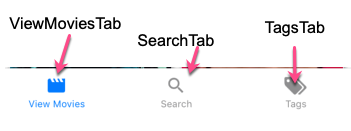

Version 5 of React Navigation breaks out each navigation component into different packages that you will import.  For most navigation scenarios, I use the following:

```bash
$ yarn add @react-navigation/native @react-navigation/stack @react-navigation/bottom-tabs @react-navigation/drawer 
```

You will also need to install some other dependencies.  If you are using **Expo**, then run this:

```bash
$ expo install react-native-gesture-handler react-native-reanimated react-native-screens react-native-safe-area-context @react-native-community/masked-view
```

If you are not using **Expo**, then check out the docs on installing dependencies for a [bare React Native Project](https://reactnavigation.org/docs/getting-started#installing-dependencies-into-a-bare-react-native-project).

## Hooks

**useNavigation**

```jsx
import * as React from 'react';
import { Button } from 'react-native';
import { useNavigation } from '@react-navigation/native';

function MyBackButton() {
  const navigation = useNavigation();

  return (
    <Button
      title="Back"
      onPress={() => {
        navigation.goBack();
      }}
    />
  );
}
```

**useIsFocused**


## Stack Navigator

### Navigate to a Specific Screen

This should apply to navigation to any screen, regardless of what type of Navigator it is located in.  To navigate to a specific screen, you will most likely be using the `navigation` prop.  It has several functions for navigation.

- **navigation.goBack**() - moves backwards in your history stack of screens.

- **navigation.navigate('route name')** - Must pass a route name to navigate to.  If you have nested navigators, I believe you can pass a second object with your own specific params and/or a `screen` param that will be a sub screen to navigat to.

   

### [Navigate to Nested Screens](https://reactnavigation.org/docs/nesting-navigators/)

You can navigate to nested screens using the **navigation.navigate** function.

The thing to understand is that the second parameter object contains params, plus if you use **screen** as one of the object properties, it will navigate to the screen.

For example, let's say you have a bottom tab with three tabs and a stack associated with each.



On the **ViewMoviesTab**, we have the **ViewStack**, which has two screens

- **ViewMovies** - But this is a stack with two Screens - **Movies** and **Filters**
- **ViewDetails** - a screen pointing to a component.

If you want to get to view Details:

```jsx
props.navigation.navigate('ViewMoviesTab', {
  screen: 'Details',
  params: { movieId: 520663 },
})
```

We navigate to the **ViewMoviesTab**, then tell it to go to the **Details** screen.  Best I can tell, everything else will be interpreted as a Param.

But what if you wanted to navigate into the ViewMovies stack and didn't want the default screen, but instead wanted to go to the filter screen.

You can do this, by nesting your screen details:

```jsx
navigation.navigate('ViewMoviesTab', {
  screen: 'ViewMovies',
  params: { screen: 'Filter', someNeededParam: 'xyz' },
});
```

This is effectively saying, go to the **ViewMoviesTab** and then to the **ViewMovies** screen.  But we know this is a stack, so we could stop there and just get the default screen or we can pass a **Params** key with another screen name.  In this case the **Filter** screen and then pass this screen some Params.

> If you want to **closeDrawer()** and then navigate to a page, you will need to put the navigate in a setTimeout
>
> ```jsx
> <DrawerItem
> label="Redirect Home"
> onPress={() => {
>   console.log('PROPS', props.navigation);
>   setTimeout(
>     () =>
>       props.navigation.navigate('ViewMoviesTab', {
>         screen: 'Details',
>         params: { movieId: 520663 },
>       }),
>     500
>   );
>   props.navigation.toggleDrawer();
> }}
> />
> ```
>
> 

### Passing Params

When setting up a Stack Navigator you have the options of passing **initialParams**, which is an object of parameters that will be passed when the screen in the stack is navigated to.

 ```jsx
<AuthStack.Navigator>
      <AuthStack.Screen
        name="SignIn"
        component={SignIn}
        options={{ title: "Sign In", animationTypeForReplace: "pop" }}
        initialParams={{ screenFunction: "signin" }}
      />
      <AuthStack.Screen
        name="CreateAccount"
        component={SignIn}
        options={{
          title: "Create Account",
          animationTypeForReplace: "pop"
        }}
        initialParams={{ screenFunction: "create" }}
      />
</AuthStack.Navigator>  
 ```

You can see in the above example, that I'm using the param **screenFunction** to determine what to show when this component is navigated to.  I'm using the same component for the *SignIn* and *CreateAccount* screens.

To access this param in the *SignIn* Component, you would need to access the route parameter that is passed into all screens

```jsx
const SignIn = ({ navigation, route }) => {
  let screenFunction = route.params?.screenFunction
  ...
}
```

Note the use of the *'?'* when getting the screenFunction.  This is the new [**optional chaining**](https://developer.mozilla.org/en-US/docs/Web/JavaScript/Reference/Operators/Optional_chaining) feature in Javascript.  

You can also set Params when navigating to a new route

```jsx
...
navigation.navigate('signin', {screenFunction: 'create'})
...
```

**Summary**

- `navigate` and `push` accept an optional second argument to let you pass parameters to the route you are navigating to. For example: `navigation.navigate('RouteName', {paramName: 'value'})`.
- You can read the params through `route.params` inside a screen
- You can update the screen's params with `navigation.setParams`
- Initial params can be passed via the `initialParams` prop on `Screen`

### Stack options Object

You can configure your stack by passing a set of options via the **options** prop.

The options prop is an object with different options.  However, most of the time, you will want to pass a function that returns the options object.  The function you pass will be called with some parameters that are essential in dynamically setting some of the options.

Here is an example setting the **headerRight** icon for a screen within a stack.

```jsx
...
<ViewStack.Navigator>
      <ViewStack.Screen
        name="ViewMovies"
        component={ViewMoviesStack}
        options={({ navigation, route }) => {
          // Using optional chaining because initial route object is for stack
          let currentScreenName =
            route?.state?.routeNames[route.state.index] || "Movies";
          let params = route?.state?.routes[route.state.index].params;

          let isFiltered = params?.isFiltered;
          let numFilters = params?.numFilters;

          return {
            title: "Movies",
            headerRight: () => {
              if (currentScreenName === "Movies") {
                return (
                  <TouchableOpacity
                    onPress={() => navigation.navigate("Filter")}
                  >
                    <FilterIcon
                      color="black"
                      size={30}
                      style={{ marginRight: 15 }}
                    />
                    {isFiltered && (
                      <Badge
                        status="success"
                        value={numFilters}
                        containerStyle={{
                          position: "absolute",
                          top: -5,
                          right: 10,
                        }}
                      />
                    )}
                  </TouchableOpacity>
                );
              } else if (currentScreenName === "Filter") {
                return (
                  <TouchableOpacity
                    onPress={() =>
                      navigation.navigate("Movies", { returning: true })
                    }
                  >
                    <CloseIcon
                      color="black"
                      size={30}
                      style={{ marginRight: 15 }}
                    />
                  </TouchableOpacity>
                );
              }
            },
          };
        }}
      />
      <ViewStack.Screen
        name="Details"
        component={ViewDetails}
        options={({ navigation, route }) => {
          console.log("DET ROUTE", route);
          console.log("Params", route?.params);
          // Using optional chaining because initial route object is for stack
          let currentScreenName =
            route?.state?.routeNames[route.state.index] || "Details";
          return {
            headerRight: () => {
              return null;
            },
          };
        }}
      />
    </ViewStack.Navigator>
...
```

There is a prop parameter the into the `headerRight` and `headerLeft` options.

Notice how many of them are undefined.  I'm wondering if this is a standard prop passed into all options functions and we just need to know what is what.

```javascript
{
  "allowFontScaling": undefined,
  "backImage": undefined,
  "canGoBack": false,
  "label": undefined,
  "labelStyle": Array [
    undefined,
    undefined,
  ],
  "labelVisible": undefined,
  "onLabelLayout": [Function anonymous],
  "onPress": undefined,
  "pressColorAndroid": undefined,
  "screenLayout": Object {
    "height": 812,
    "width": 414,
  },
  "tintColor": undefined,
  "titleLayout": Object {
    "height": 21,
    "width": 39,
  },
  "truncatedLabel": undefined,
}
```

Currently the parameters passed that I know of are:

#### `navigation `Parameter

The **navigation** parameter is passed to screens directly called by React Navigation.  If you need the navigation parameter in a component that doesn't get this parameter passed, you can use the hook `useNavigation` to get access to it.

```javascript
import { useNavigation } from "@react-navigation/native";
```

The most common thing you will use the **navigation** parameter for is to **navigate** to other screens.

The other is to access the **setOptions** and **setParams** functions.

#### navigation - setOptions

The **setOptions** is useful if you wanted to change the options (title, header icon, etc) from within your component.

```javascript
...
const ViewDetails = ({ navigation, route }) => {
  let movieId = route.params?.movieId;
  // Set the title to the current movie title
  navigation.setOptions({ title: movie.title });
  
  return (
    ...
    );
...    
```

#### navigation - setParams

The setParams function of the navigation parameter lets you set the Params for the Route that you are in.

```javascript
const ViewMovies = ({ navigation, route }) => {
  const { state, actions } = useOvermind();
  useEffect(() => {
    navigation.setParams({
      isFiltered: state.oSaved.filterData.tags.length > 0,
      numFilters: state.oSaved.filterData.tags.length,
    });
  }, [state.oSaved.filterData.tags.length]);
  return ( ... );
}
```


The resulting route object will look like this:

```javascript

routeObj = {
  "key": "ViewMovies-Riwdc770gfEQ4j2taPrcC",
  "name": "ViewMovies",
  "params": undefined,
  "state": Object {
    "index": 1,
    "key": "stack-4JjmGo70wv-Pvce1LTDDD",
    "routeNames": Array [
      "Movies",
      "Filter",
    ],
    "routes": Array [
      Object {
        "key": "Movies-aWZr8QGjN27WYObSQybXK",
        "name": "Movies",
        "params": Object {
          "isFiltered": false,
          "numFilters": 0,
        },
      },
      Object {
        "key": "Filter-Y5ms14pTYFFowAmqZ-a4x",
        "name": "Filter",
        "params": undefined,
      },
    ],
    "stale": false,
    "type": "stack",
  },
}
```


#### route Parameter

This is a route object.  The information in this route object varies depending on if the route you are on is a "stack" or a screen. 

 For example, I have a **ViewMovieStack** which contains two screens a View Movies screen and View Details screen.  However, the View Movies Screen is actually a stack with two screens within it.
When you first access the **ViewMovieStack** it's route object looks like this:

```json
{
  "key": "ViewMovies-j9eLVEtmovi",
  "name": "ViewMovies",
  "params": undefined,
}
```

But, once you navigate to another screen and come back to a specific screen like "movies", you will see this object:

```json
{
  "key": "ViewMovies-j9eLVEtmovi",
  "name": "ViewMovies",
  "params": undefined,
  "state": Object {
    "index": 0,
    "key": "stack-mE2AAHAyTdk",
    "routeNames": Array [
      "Movies",
      "Filter",
    ],
    "routes": Array [
      Object {
        "key": "Movies-p9XliDnxI_H",
        "name": "Movies",
        "params": undefined,
      },
    ],
    "stale": false,
    "type": "stack",
  },
}
```

Given this, if you want to set the header icon (done in options), you need to be aware of the different formats of the Route object.  Luckily **Optional Chaining** really helps us out here.  

Below is the function you would pass to the options parameter to set the right header to a different icon depending on which screen you are on.  Here is the example:


Here is the JSX for the Stack

```jsx
<ViewStack.Navigator mode="modal">
      <ViewStack.Screen
        name="ViewMovies"
        component={ViewMoviesStack}
        options={viewMoviesOptions}
      />
      <ViewStack.Screen name="Details" component={ViewDetails} />
    </ViewStack.Navigator>
```

Here is the code for the options function:

```jsx
const viewMoviesOptions = ({ navigation, route }) => {
// Need to use optional chaining because on first show of this route (which is a stack), the route object looks like this:
  // ROUTE = {
  //   "key": "ViewMovies-j9eLVEtmovi",
  //   "name": "ViewMovies",
  //   "params": undefined,
  // }
// If optional chaining fails, it is assumed i am at the route of "Movies"
  let currentScreenName =
    route?.state?.routeNames[route.state.index] || "Movies";
  return {
    headerRight: () => {
      if (currentScreenName === "Movies") {
        return (
          <TouchableOpacity onPress={() => navigation.navigate("Filter")}>
            <FilterIcon color="black" size={30} style={{ marginRight: 15 }} />
          </TouchableOpacity>
        );
      } else if (currentScreenName === "Filter") {
        return (
          <TouchableOpacity onPress={() => navigation.navigate("Movies")}>
            <CloseIcon color="black" size={30} style={{ marginRight: 15 }} />
          </TouchableOpacity>
        );
      }
    }
  };
};
```


## Tab Navigator Icons

When you create a tab navigator, you most likely will want to have icons for each "tab".

You do this by setting them in the **screenOptions** prop on the **Tab.Navigator** component. Specifically, there is a property called **tabBarIcon**, which you will define a function for, which will return the icon for specified tab.

```jsx
<AppTabs.Navigator
      initialRouteName="ViewMovies"
      screenOptions={({ route }) => ({
        tabBarIcon: ({ focused, color, size }) => {
          let iconName;
          if (route.name === "ViewMovies") {
            // Just showing how to use 'focused' var.  Once documented, then remove
            iconName = focused ? "movie" : "movie";
          } else if (route.name === "Search") {
            iconName = "search";
          }
          // You can return any component that you like here!
          return (
            <MaterialIcons
              name={iconName}
              size={size}
              color={color}
              style={{ marginTop: 5 }}
            />
          );
        }
      })}
      tabBarOptions={{
        activeTintColor: "tomato",
        inactiveTintColor: "gray"
      }}
    >
      <AppTabs.Screen
        name="ViewMovies"
        component={ViewStack}
        options={{ title: "View Movies" }}
      />
      <AppTabs.Screen name="Search" component={SearchStack} />
    </AppTabs.Navigator>
```

> Note: I will usually pull the whole *screenOptions* function out into a separate function.  It makes it easier to read.

It is important to note that **route** is one parameter that is passed to the main screenOptions function.  Now **route** can be used in any of the other function, like *tabBarIcon*.

The **tabBarIcon** property also accepts a function, some of its params are **focused**, **color**, **size**. 

**focused** - tells us if the **route.name** is currently focused.  You can imagine this function running every time the tab screen is rerendered.  If, one of the tabs is pressed, it runs through this function to reset the icons and focused state.  This is useful if you want to show a different icon or color for the focused tab.

**color** - This is either a defaulted to a system color or if you set **activeTintColor** and **inactiveTintColor** in **tabBarOptions**, those will be used.


## [Add Badges to Icons](https://reactnavigation.org/docs/tab-based-navigation#add-badges-to-icons)

## Drawer Navigator

[Drawer Docs](https://reactnavigation.org/docs/drawer-based-navigation/)

The Drawer pulls out from the left or right.

### Custom Content in Drawer

You have full control over what is displayed in the drawer.  To do so, you will need to create a component that holds the custom content.

React Navigation provides wrapping components to make your life easier.  

- DrawerContentScrollView - is this scrollview that encompasses the content. 
- DrawerItemList - this contains the screen that are children to your main drawer.  If you don't have any screens and are creating all custom content, you don't need this component.
- DrawerItem - The component that allows you to create your own item.

**Custom Drawer Contents component**

```jsx
// The DrawerContentScrollView takes care of housekeeping for scroll view (notches, etc)
// The DrawerItemList displays the screens that you pass as children to your drawer
// The DrawerItem components are your custom components
// props sent to custom drawer include navigation

function CustomDrawerContent(props) {
  return (
    <DrawerContentScrollView {...props}>
      <DrawerItemList {...props} />
      <DrawerItem
        label="Settings"
        onPress={() => props.navigation.navigate('Settings')}
        style={{
          borderBottomColor: 'black',
          borderBottomWidth: 1,
          width: '100%',
          padding: 0,
        }}
      />
    </DrawerContentScrollView>
  );
}
```

**Props Passed to Custom Content Component**

To use this custom content, you will need to use the **drawerContent** prop on the Drawer Navigator component.  This will pass props to your custom content component.  These are the props:

- **`state`** - The navigation state of the navigator, `state.routes` contains list of all routes
- **`navigation`** - The navigation object for the navigator.
- **`descriptors`** - An descriptor object containing options for the drawer screens. The options can be accessed at `descriptors[route.key].options`.
- **`progress`** - Reanimated Node that represents the animated position of the drawer (0 is closed; 1 is open).

**Props passed to the DrawerItem Component**

The `DrawerItem` component accepts the following props:

- **`label (required):`** The label text of the item. Can be string, or a function returning a react element. e.g. ({ focused, color }) => <Text style={{ color }}>{focused ? 'Focused text' : 'Unfocused text'}</Text>.
- **`icon:`** Icon to display for the item. Accepts a function returning a react element. e.g. ({ focused, color, size }) => <Icon color={color} size={size} name={focused ? 'heart' : 'heart-outline'} />.
- **`focused:`** Boolean indicating whether to highlight the drawer item as active.
-  **`onPress (required):`** Function to execute on press.
-  **`activeTintColor:`** Color for the icon and label when the item is active.
- **`inactiveTintColor:`** Color for the icon and label when the item is inactive.
- **`activeBackgroundColor:`** Background color for item when it's active.
- **`inactiveBackgroundColor:`** Background color for item when it's inactive.
- **`labelStyle:`** Style object for the label Text.
- **`style:`** Style object for the wrapper View.

**Using Custom Content**

You will user your custom content component by passing it via the **drawerContent** prop on the Drawer.Navigator component.

```jsx
<Drawer.Navigator
  drawerType="front"
  drawerStyle={{ backgroundColor: '#ccc' }}
  drawerContent={(props) => <CustomDrawerContent {...props} />}
>
  <Drawer.Screen name="<" component={AppTabsScreen} />
  <Drawer.Screen name="Home" component={RedirectToMain} />
  <Drawer.Screen name="Settings" component={Settings} />
  <Drawer.Screen name="Sign Out" component={SignOut} />
</Drawer.Navigator>
```


### useIsDrawerOpen

To determine if a drawer is opened or closed

```jsx
import { useIsDrawerOpen } from '@react-navigation/drawer';

// ...

const isDrawerOpen = useIsDrawerOpen();
```

